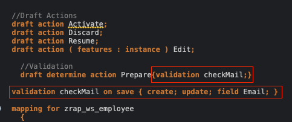
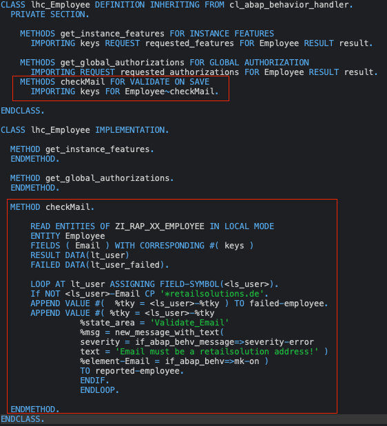
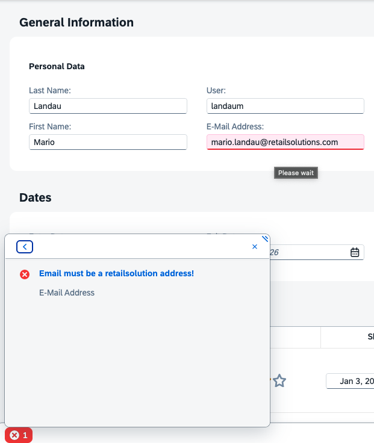
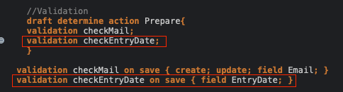
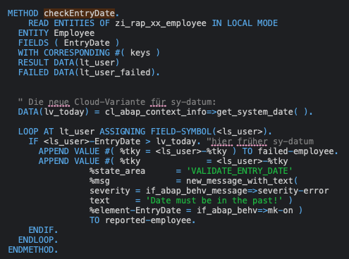

# 1 Validation

- [RAP Dokumentation - Validation](https://help.sap.com/doc/abapdocu_cp_index_htm/CLOUD/en-US/ABENBDL_VALIDATIONS.html)


## 1.1 Validation Email
In der ZI_RAP_XX_EMPLOYEE behavior Definition ergänzen wir bei 'draft determine action Prepare' folgendes:
<figure style="border:1px solid #aaa; padding:10px; display:inline-block;">
  
</figure>


Über die Glühlampe können wir uns die Methode generieren lassen, oder wir wechseln in die ZBP_I_RAP_XX_EMPLOYEE und legen sie selbst an.
<figure style="border:1px solid #aaa; padding:10px; display:inline-block;">
  
</figure>

Wenn wir jetzt versuchen eine Email mit einer anderen Endung anzugeben, bekommen wir einen Fehler beim Speichern.

<figure style="border:1px solid #aaa; padding:10px; display:inline-block;">
  
</figure>

>**HINWEIS** Eclipse hat auch einen Debugger. Gerne mal einen Breakpoint in Zeile mit der "If NOT" Bedingung der checkMail Methode setzen und ihn aus dem Frontend triggern (Trigger durch eine Falsche Email und dann Klick auf Save).

### 1.2 EML 
- [EML - Read Entities](https://help.sap.com/doc/abapdocu_cp_index_htm/CLOUD/en-US/ABAPREAD_ENTITIES_LONG.html)

EML (Entity Manipulation Language) ist eine auf ABAP basierende und speziell für RAP entwickelte Programmiersprache. Mit EML können ABAP-Programme type-sicher auf RAP-Geschäftsobjekte zugreifen und deren Daten manipulieren.

Vorteile:
- Einhaltung der Business-Logik: Anders als beim direkten Lesen (z.B. über klassisches Open SQL) werden bei EML alle Validierungen, Berechnungen (Determinations) und Einstellungen durchlaufen, die im RAP-Verhaltensmodell (Behavior Definition) definiert sind. Sie umgehen Ihre eigene Geschäftslogik also nicht.
- Draft-Unterstützung: EML ermöglicht es, Daten aus dem Draft-Puffer (nicht gespeicherte Änderungen in Fiori-Apps) und der echten Datenbank zu lesen und zu bearbeiten.
- Ersatz für BAPIs: Es bietet eine standardisierte Schnittstelle, um alte ABAP-Programme oder Klassen nahtlos an moderne RAP-Geschäftsobjekte anzubinden.

### 1.3 Validation checkEntryDate
Wir überprüfen, ob das Eintrittsdatum in der Vergangenheit liegt.

Dazu fügen wir wieder in der ZI_RAP_XX_EMPLOYEE Behavior Definition folgendes hinzu:

<figure style="border:1px solid #aaa; padding:10px; display:inline-block;">
  
</figure>


Oben wieder die Methode hinzufügen:
>IMPORTING keys FOR Employee~checkMail. METHODS checkEntryDate FOR VALIDATE ON SAVE IMPORTING keys FOR Employee~checkEntryDate.

Sowie unten die Methode:
<figure style="border:1px solid #aaa; padding:10px; display:inline-block;">
  
</figure>

# 2. Determinations 
[RAP Dokumentation - Determination](https://help.sap.com/doc/abapdocu_cp_index_htm/CLOUD/en-US/ABENBDL_DETERMINATIONS.html)

**Szenario:** Bei der Auswahl des Usernames soll automatisch der Vorname & Nachname belegt werden.
Das UI soll sich live updaten im Draft Modus.

**MODIFY**
```eml
MODIFY ENTITIES OF bdef (IN LOCAL MODE)
ENTITY entityName
UPDATE FIELDS (field1, field2) WITH update_tab_structure
```

**Generierte Datentypen vom Framework - Bdef Derived Types**
[TYPE TABLE FOR](https://help.sap.com/doc/abapdocu_cp_index_htm/CLOUD/en-US/ABAPTYPE_TABLE_FOR.html)
```abap
DATA: lt_update_employees TYPE TABLE FOR UPDATE zi_rap_XX_employee.
```

**Problem: Updates kommen nicht im UI an**

#### Side Effects 🌊
[Side effects](https://help.sap.com/doc/abapdocu_cp_index_htm/CLOUD/en-US/ABENBDL_SIDE_EFFECTS.html)

Mit Hilfe von Side Effects können wir dem Framework mitteilen, dass es gewisse Entitäten, Felder, Nachrichten im UI nachladen muss.

**Syntax**
```bdef
side effects {
  field MyField affects Targets;
  ...
}
```

Folgende Targets können benutzt werden:
- Felder,
- Berechtigungen,
- die auslösende Entität $self
- eine andere Entität
- Nachrichten

Zusätzlich müssen Side Effects in der Consumption View aktiviert werden
```bproj
use side effects;
```
#### Stolperfallen 🚧
**Problem: Determination wird bei Feldänderung im Draft und bei Speichern ausgeführt - Nutzereingaben werden eventuell wieder überschrieben**

 ```abap
IF keys[ 1 ]-%is_draft = if_abap_behv=>mk-off.
      RETURN.
ENDIF.
 ```


# 3. Feldsteuerung und Action
## 3.1 Feldsteuerung (Feature Instance)
- [RAP Dokumentation - Field Characteristics](https://help.sap.com/doc/abapdocu_cp_index_htm/CLOUD/en-US/ABENBDL_FIELD_CHAR.html)