# RAP Hands-On
---
## Kapitel 1: Grundlagen CDS View

- Was ist RAP?

Das RESTful ABAP Programming Model (RAP) ist das aktuelle Programmiermodell von SAP für die Entwicklung von Fiori-Applikationen und OData-Services auf Basis von ABAP. Es wurde mit SAP S/4HANA und der SAP Business Technology Platform (BTP) eingeführt und löst ältere Ansätze wie das BOPF-Framework (Business Object Processing Framework) ab.
RAP kombiniert CDS Views (Core Data Services) für die Datenschicht mit ABAP-Klassen für die Geschäftslogik – alles nach einem klar definierten, durchgängigen Schichtenmodell.

- Warum RAP?

Früher wurden SAP-Anwendungen oft mit einem Mix aus klassischen ABAP-Reports, BAPIs, Function Modules und SAP Gateway-Projekten gebaut. Das führte zu:

- uneinheitlichen Architekturen
- schwer wartbarem Code
- aufwändiger OData-Entwicklung

RAP löst das durch ein standardisiertes, deklaratives Entwicklungsmodell, das direkt auf OData V4 und Fiori Elements ausgelegt ist.


### Kapitel 1.1: Aufbau CDS Views

[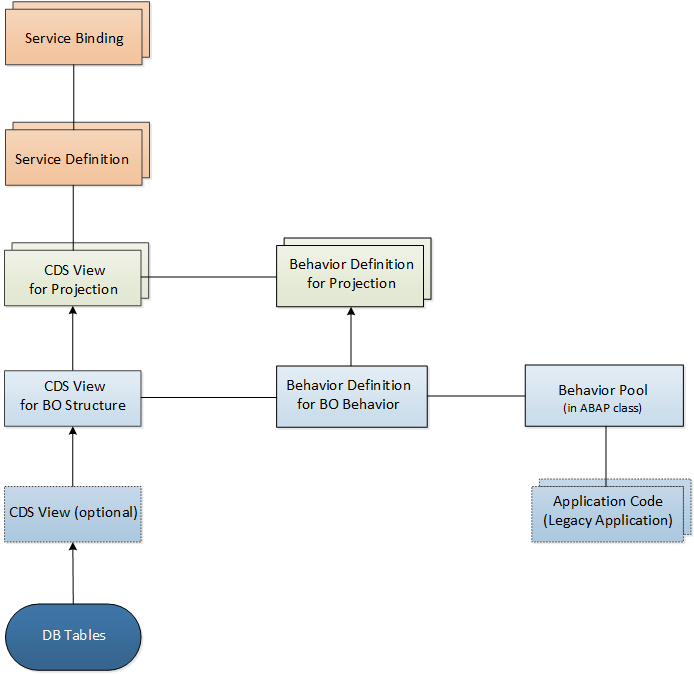](https://help.sap.com/docs/abap-cloud/abap-rap/developing-managed-transactional-apps?locale=en-US&version=LATEST)

*Abb. Aufbau CDS Views: https://help.sap.com/docs/abap-cloud/abap-rap/developing-managed-transactional-apps?locale=en-US&version=sap_cross_product_abap*

### Kapitel 1.2: Namenskonvention
Namenskonventionen bei CDS Views dienen der Identifikation und Transparenz.

Die SAP Doku zu den Namenskonventionen ist unter 
[Namenskonventionen im virtuellen Datenmodell](https://help.sap.com/docs/SAP_S4HANA_CLOUD/c0c54048d35849128be8e872df5bea6d/8a8cee943ef944fe8936f4cc60ba9bc1.html?locale=de-DE&version=LATEST "Namenskonventionen im virtuellen Datenmodell") zu finden und die Erläuterung zu den Annotations unter [VDM Annotations](https://help.sap.com/docs/ABAP_PLATFORM_NEW/cc0c305d2fab47bd808adcad3ca7ee9d/efe9c80fc6ba4db692e08340c9151a17.html?locale=en-US&version=LATEST "VDM Annotations")

SAP empfiehlt folgeden Aufbau:

- Präfix (obligatorisch)
- Semantischer Name (obligatorisch)
- Suffix (optional)
- Versionsnummer (optional)

#### Präfix:
Die häufigsten Präfix sind wie folgt definiert:

<table>
  <thead>
    <tr>
      <th>Präfix</th>
      <th>View Typ</th>
      <th>Kennzeichnung</th>
    </tr>
  </thead>
  <tbody>
    <tr>
      <td>C_*</td>
      <td>Consumption-View</td>
      <td>@VDM.ViewType: #CONSUMPTION</td>
    </tr>
    <tr>
      <td rowspan="2" >I_*</td>
      <td>Basic-Interface-View</td>
      <td>@VDM.ViewType: #BASIC </td>
    </tr>
    <tr>
      <td>Composite-Interface-View</td>
      <td>@VDM.ViewType: #COMPOSITE</td>
    </tr>
    <tr>
      <td>E_*</td>
      <td>Extension-Include-View</td>
      <td>@VDM.viewType: #EXTENSION</td>
    </tr>
    <tr>
      <td>X_*</td>
      <td>View-Erweiterung</td>
      <td>@VDM.viewExtension: true</td>
    </tr>
    <tr><td></td><td></td><td></td></tr>
    <tr>
      <td>A_*</td>
      <td>Remote-API-View</td>
      <td>@VDM.lifecycle.contract.type: #PUBLIC_REMOTE_API</td>
    </tr>
    <tr>
      <td rowspan="2">R_*</td>
      <td>Restricted-Reuse-Interface-View</td>
      <td rowspan="2">@VDM.lifecycle.contract.type: #SAP_INTERNAL_API</td>
    </tr>
    <tr>
      <td>Restricted-Reuse-Composite-View</td>
    </tr>
    <tr>
      <td>P_*</td>
      <td>Privater View</td>
      <td>@VDM.private: true</td>
    </tr>
  </tbody>
</table>


 #### Suffix:

| Suffix | View Typ |
|----------|----------|
| Query, Qry, oder Q | Analytische Query-View | 
| Cube oder C | Analytische Cube-View | 
| Text, Txt, T | Provider für sprachabhängigen Text | 
| TP | View für transaktionale Verarbeitung |
| VH oder StdVH | View für Wertehilfe | 


---
## Vor dem Start
- Jeder hat einen User erhalten. Bitte benennt alle Objekte mit eurer Usernummer. Das heißt alle "XX" in den Namen werden durch eure Usernummer ausgetauscht. Beispielsweise wäre es dann "01" für den User 1
- **<span style="color: #053ee8ff">Transport</span>** für das Paket anlegen, Beschreibung **<span style="color: #053ee8ff">Z_RAP_XX</span>**
- **<span style="color: #053ee8ff">Paket</span>** anlegen mit dem Namen **<span style="color: #053ee8ff">Z_RAP_XX</span>**
- Default ABAP Language Version **<span style="color: #053ee8ff">ABAP for Cloud Development</span>**

<figure style="border:1px solid #aaa; padding:10px; display:inline-block;">
  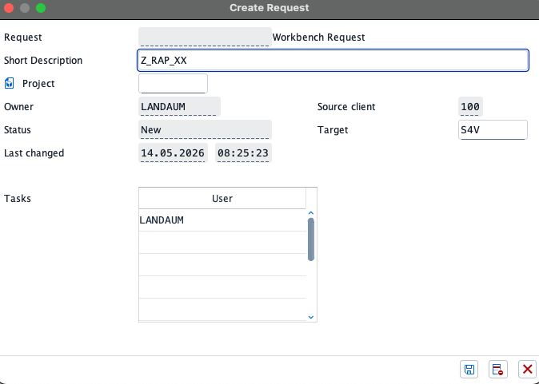
  <figcaption style="text-align:center;"><span style="color: red">XX durch die Nummer ersetzen</span></figcaption>
</figure>

<figure style="border:1px solid #aaa; padding:10px; display:inline-block;">
  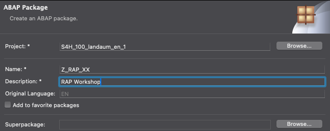
       <figcaption style="text-align:center;"><span style="color: red">XX durch die Nummer ersetzen</span></figcaption>
</figure>
<figure style="border:1px solid #aaa; padding:10px; display:inline-block;">
  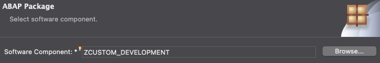
</figure>
<figure style="border:1px solid #aaa; padding:10px; display:inline-block;">
  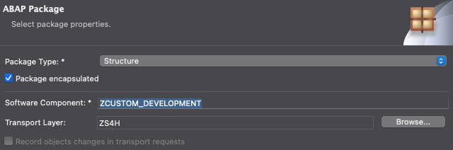
</figure>
<figure style="border:1px solid #aaa; padding:10px; display:inline-block;">
  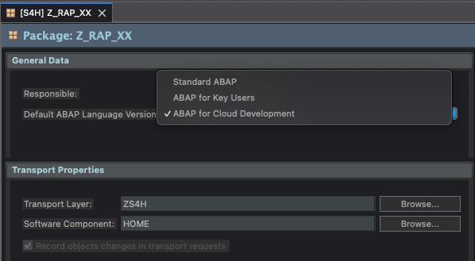
</figure>

## 2. Teil: Root Entity anlegen

- Paket: Z_RAP_XX
- Name: ZI_RAP_XX_EMPLOYEE
- Beschreibung Employee
- Referenz: zrap_ws_employee

Um eine Root Entity anzulegen klicke mit der rechten Maustaste auf die Tabelle ZRAP_WS_EMPLOYEE vom Paket Z_RAP_WS und wähle "New Data Definition" aus

<figure style="border:1px solid #aaa; padding:10px; display:inline-block;">
  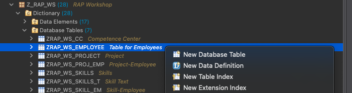
</figure>

Trage im Popup alle Daten gemäß dem Screenshot ein. Achte hierbei wieder darauf "XX" mit deiner Nummer zu ersetzen! Nach Eingabe der Informationen bitte nur auf "Next" und NICHT auf "Finish" klicken!

<figure style="border:1px solid #aaa; padding:10px; display:inline-block;">
  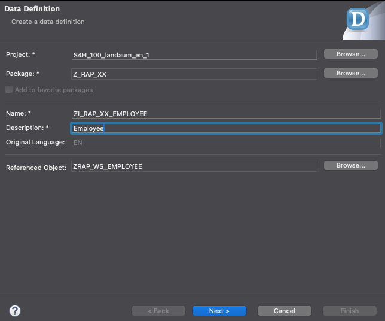
       <figcaption style="text-align:center;"><span style="color: red">XX durch die Nummer ersetzen</span></figcaption>
</figure>

Im nächsten Screen kann dann schließlich ausgewählt werden, welche View definieren werden soll. Beim durchklicken der verschiedenen Optionen fällt auf, dass sich die vorgegebenen Annotationen ändern. Wähle hier nun "defineRootViewEntity".

<figure style="border:1px solid #aaa; padding:10px; display:inline-block;">
  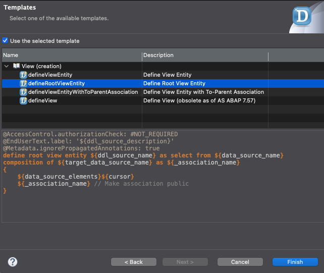
</figure>

Nach dem Anlegen sieht die Datei so aus:

<figure style="border:1px solid #aaa; padding:10px; display:inline-block;">
  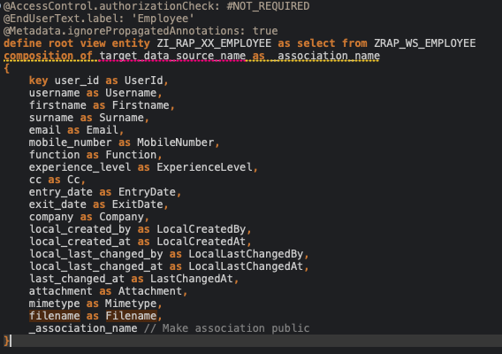
</figure>

Kommentiere bitte die Zeile "composition of target_data_source_name as _association_name" aus. Darauf hin wird die Zeile " _association_name" rot untersrichen. Kommentiere auch diese aus und das Kommar hinter "Filename". Die Datei sollte nun so aussehen:

<figure style="border:1px solid #aaa; padding:10px; display:inline-block;">
  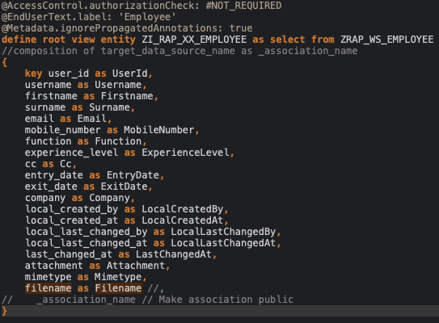
</figure>

> **Hinweis:** SAP CDS View Annotations sind Metadaten-Tags mit dem Präfix @, die CDS-Ansichten (Core Data Services) mit zusätzlichen Informationen anreichern und technische und semantische Eigenschaften definieren.

|Annotation|Bedeutung|
|--|--|
|@AccessControl.authorizationCheck| Berechtigungsprüfung|
|@EndUserText.label| Label der Entität|
|@Metadata.ignorePropagatedAnnotations|Definiert ob Annotations von verwendeten CDS-Objekten übernommen werden sollen|

Füge im Anschluss folgende Annotationen hinzu:

      //Administrative data
      @Semantics.user.createdBy: true
      local_created_by                                                      as LocalCreatedBy,
      @Semantics.systemDateTime.createdAt: true
      local_created_at                                                      as LocalCreatedAt,
      @Semantics.user.lastChangedBy: true
      local_last_changed_by                                                 as LocalLastChangedBy,
      @Semantics.systemDateTime.lastChangedAt: true
      local_last_changed_at                                                 as LocalLastChangedAt,
      @Semantics.systemDateTime.localInstanceLastChangedAt: true
      last_changed_at        

      
### 2.2 Consumption View

- Paket: Z_RAP_XX
- Name: ZC_RAP_XX_EMPLOYEE
- Beschreibung Employee
- Referenz: ZI_RAP_XX_EMPLOYEE

Um eine Consumption View anzulegen klicke mit der rechten Maustaste auf die Tabelle ZI_RAP_XX_EMPLOYEE vom Paket Z_RAP_XX und wähle "New Data Definition" aus. 

<figure style="border:1px solid #aaa; padding:10px; display:inline-block;">
  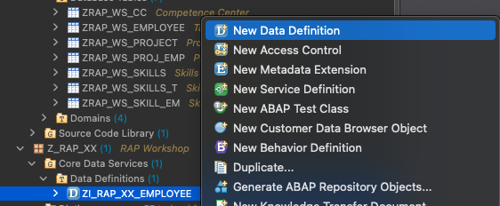
</figure>


<figure style="border:1px solid #aaa; padding:10px; display:inline-block;">
  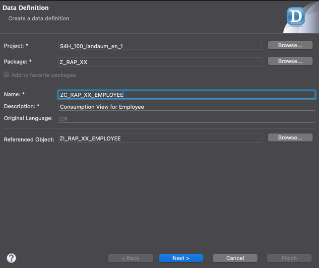
       <figcaption style="text-align:center;"><span style="color: red">XX durch die Nummer ersetzen</span></figcaption>
</figure>

Trage im Popup alle Daten gemäß dem Screenshot ein. Achte hierbei wieder darauf "XX" mit deiner Nummer zu ersetzen! Nach Eingabe der Informationen bitte nur auf "Next" und NICHT auf "Finish" klicken!
Denn auch hier können wir bestimmen welchen Typ View wir uns generieren lassen wollen. Wähle hier unter dem Reiter Projection View "defineProjectionView" aus. 

<figure style="border:1px solid #aaa; padding:10px; display:inline-block;">
  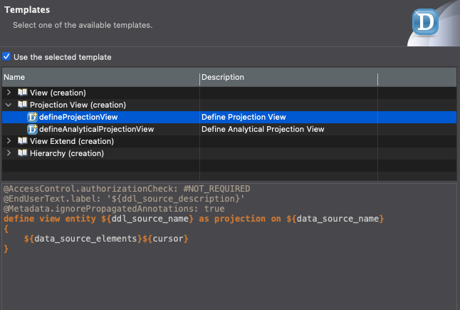
</figure>

In der generierten Datei wird zunächst ZC_RAP_XX_EMPLOYEE rot unterstrichen. Das liegt daran, dass es eine Projection-View von unserer ZI_RAP_XX_EMPLOYEE ist. Da diese als Root-Entity definiert ist, muss das auch für die Projection-View definiert werden. Außerdem ergänzen wir "provider contract transactional_query" und weitere Annotationen:

    @Metadata.allowExtensions: true
    @ObjectModel.semanticKey: [ 'UserId' ]

  <figure style="border:1px solid #aaa; padding:10px; display:inline-block;">
  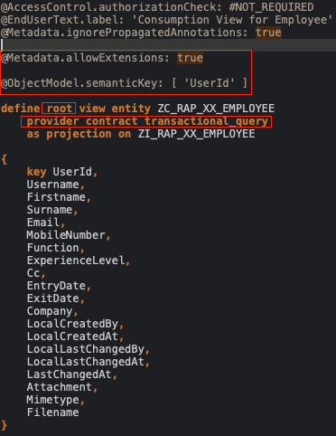
</figure>

### 2.3. UI Annotationen auf Root Entität (ohne Value Help)
- Paket: Z_RAP_XX
- Name: ZC_RAP_XX_EMPLOYEE
- Beschreibung Employee
- Erweiterte Entität: ZI_RAP_XX_EMPLOYEE

Die Metadata Extension wird genau so benannt wie die Consumption View. Lege die Extension mit einem Rechtsklick auf die ZC_RAP_XX_EMPLOYEE an.

  <figure style="border:1px solid #aaa; padding:10px; display:inline-block;">
  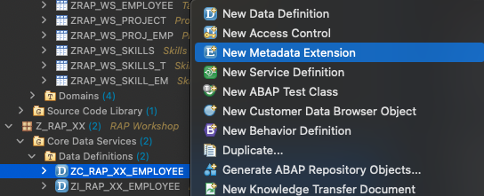
</figure>

  <figure style="border:1px solid #aaa; padding:10px; display:inline-block;">
  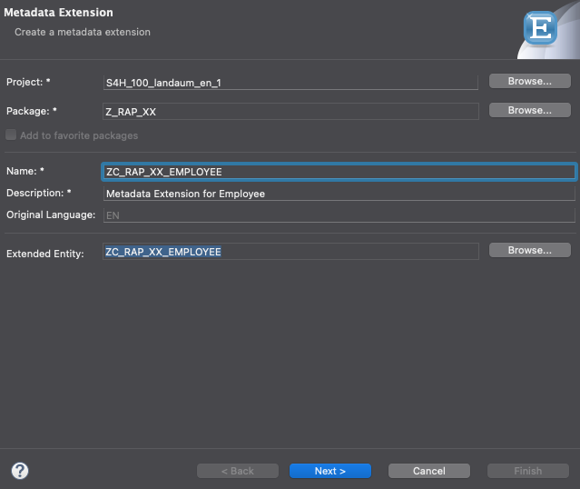
       <figcaption style="text-align:center;"><span style="color: red">XX durch die Nummer ersetzen</span></figcaption>
</figure>

Trage im Popup alle Daten gemäß dem Screenshot ein. Achte hierbei wieder darauf "XX" mit deiner Nummer zu ersetzen! Nach Eingabe der Informationen bitte nur auf "Next" und NICHT auf "Finish" klicken!
Denn auch hier können wir bestimmen welchen Typ wir generieren lassen wollen. Wähle hier unter dem Reiter Annotate Entity "annotateEntity" aus. 

 <figure style="border:1px solid #aaa; padding:10px; display:inline-block;">
  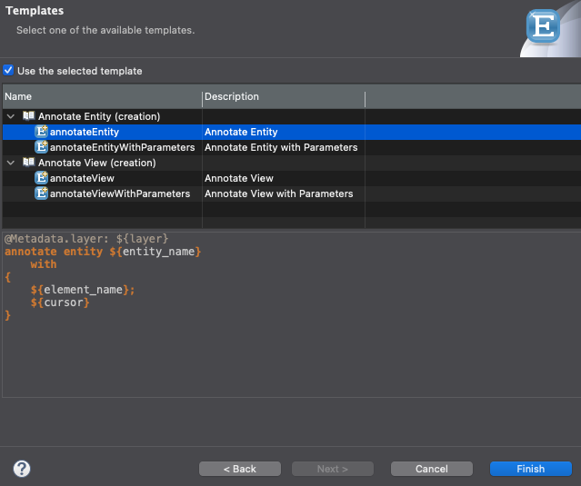
</figure>

Ändere in der generierten Datei die Metadata.layer zu #CORE und füge folgende die Elemente hinzu 

    @Metadata.layer: #CORE

    @UI: {
      presentationVariant: [{ requestAtLeast: ['UserId'] }]
    }
    annotate entity ZC_RAP_XX_EMPLOYEE with
    {

      // Personal data
      @UI.hidden: true
      UserId;

      @UI.lineItem: [{ position: 10, importance: #MEDIUM } ]
      @UI.identification: [ { position: 30 } ]
      Username;

      @UI.lineItem: [ { position: 20, importance: #MEDIUM } ]
      @UI.identification: [ { position: 10 } ]
      @UI.selectionField: [{ position: 10 }]
      Surname;

      @UI.lineItem: [ { position: 30, importance: #MEDIUM } ]
      @UI.identification: [ { position: 20 } ]
      @UI.selectionField: [{ position: 20 }]
      Firstname;
    }

### 2.4 Service Anlegen

- Paket: Z_RAP_XX
- Name: ZUI_RAP_XX_EMPLOYEE
- Beschreibung: Employee
- Referenz: ZC_RAP_XX_EMPLOYEE


- Rechtsklick auf die Consumption View → New Service Definition

<figure style="border:1px solid #aaa; padding:10px; display:inline-block;">
  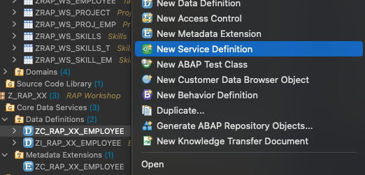
</figure>

<figure style="border:1px solid #aaa; padding:10px; display:inline-block;">
  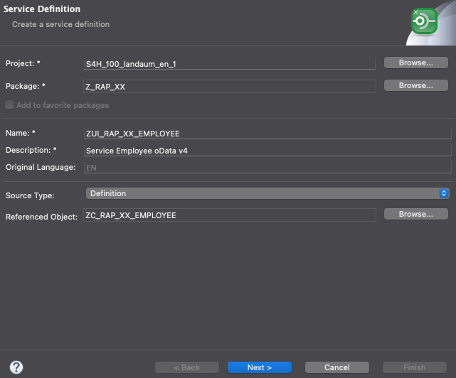
       <figcaption style="text-align:center;"><span style="color: red">XX durch die Nummer ersetzen</span></figcaption>
</figure>

Trage im Popup alle Daten gemäß dem Screenshot ein. Achte hierbei wieder darauf "XX" mit deiner Nummer zu ersetzen! Nach Eingabe der Informationen kann hier auf Finish geklickt werden, da es bisher nur einen Template für die Service Definition gibt. Es kann aber natürlich auch wieder mit Next durchgeklickt werden.

Die Datei sieht im Anschluss so aus:
<figure style="border:1px solid #aaa; padding:10px; display:inline-block;">
  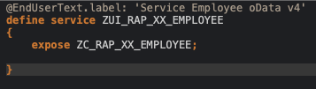
</figure>

### 2.5 Service Binding

Rechtsklick auf Service Definition → New Service Binding

- Name: ZUI_RAP_XX_EMPLOYEE_V4
- Binding Typ: OData V4 - UI
- Beschreibung: Service Employee OData v4

<figure style="border:1px solid #aaa; padding:10px; display:inline-block;">
  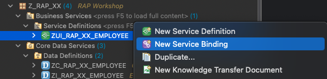
</figure>

<figure style="border:1px solid #aaa; padding:10px; display:inline-block;">
  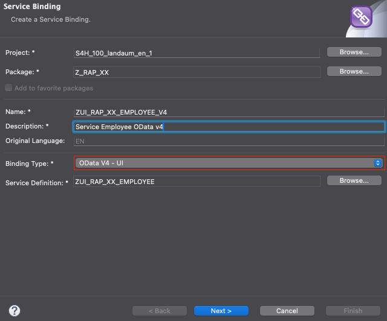
       <figcaption style="text-align:center;"><span style="color: red">XX durch die Nummer ersetzen</span></figcaption>
</figure>

Trage im Popup alle Daten gemäß dem Screenshot ein. Achte hierbei wieder darauf "XX" mit deiner Nummer zu ersetzen! Nach Eingabe der Informationen kann hier auf Finish geklickt werden.

<figure style="border:1px solid #aaa; padding:10px; display:inline-block;">
  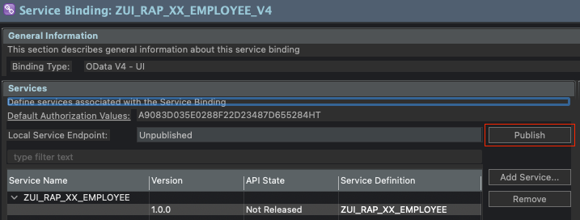
</figure>

Service Binding aktivieren und anschließend publizieren. 


### 2.6 Preview
Klicke auf Preview um die Vorschau zu öffnen. Nach dem Klick öffnet sich der Browser. Dort muss allerdings die URL angepasst werden

<figure style="border:1px solid #aaa; padding:10px; display:inline-block;">
  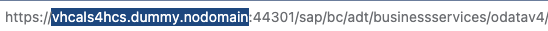
</figure>

Ersetze den markierten Teil durch die IP-Adresse des Systems:

<figure style="border:1px solid #aaa; padding:10px; display:inline-block;">
  
</figure>

Danach sollte die Vorschau angezeigt werden. Mit einem Klick auf "Go" sollten auch schon die ersten Daten kommen.

<figure style="border:1px solid #aaa; padding:10px; display:inline-block;">
  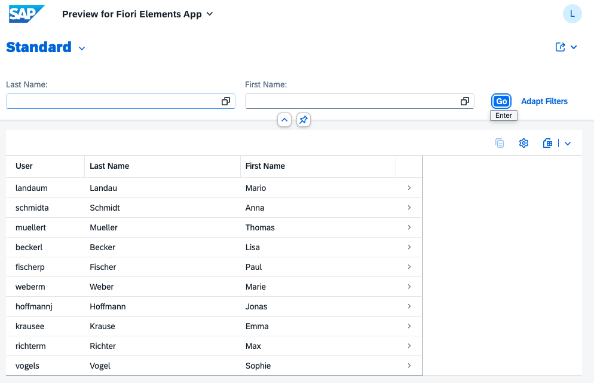
</figure>

#### 2.6.1 UI Annotationen erweitern

Mit einem Klick auf einen beliebigen Mitarbeiter, stellt man schnell fest, dass dort noch nichts angezeigt wird. Das werden wir jetzt ändern.

#### 2.6.1.1 Section
Zuerst fügen wir die Section hinzu, in dem wir folgendes in unsere Metadata Extension direkt über //Personal Data hinzufügen:

      //Sections
      @UI.facet: [
        { id: 'idIdentification',
          type: #IDENTIFICATION_REFERENCE, /* Refers to elements annotated with '@UI.identification' */
          label: 'Personal Data',
          position: 10
        }
      ]
      //Personal data


Nach einem Refresh und erneuten Klick auf einen Mitarbeiter, sieht die Seite jetzt so aus: 

<figure style="border:1px solid #aaa; padding:10px; display:inline-block;">
  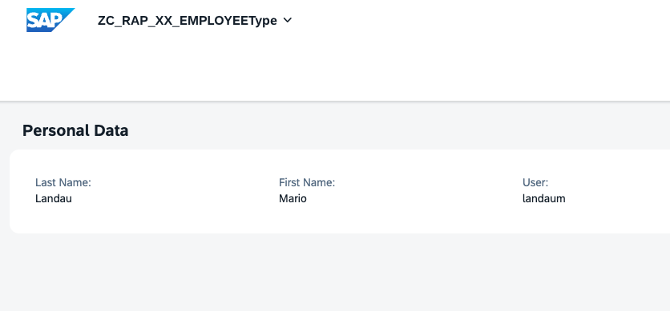
</figure>

## 3. Teil: Erste Kindsentität anlegen

### 3.1 Interface und Consumption View für Kindsentität anlegen
#### 3.1.1 Interface View anlegen
Anlagedaten der Interface-View: 
- View-Name: ZI_RAP_XX_EMP_SKILLS
- Beschreibung: Employee Skills
- Referenz: ZRAP_WS_SKILL_EM


Lege eine neue Interface-View an durch einen Rechtsklick auf Data Definition und dann wähle New Data Definition aus.

<figure style="border:1px solid #aaa; padding:10px; display:inline-block;">
  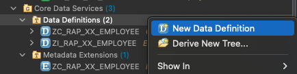
</figure>


<figure style="border:1px solid #aaa; padding:10px; display:inline-block;">
  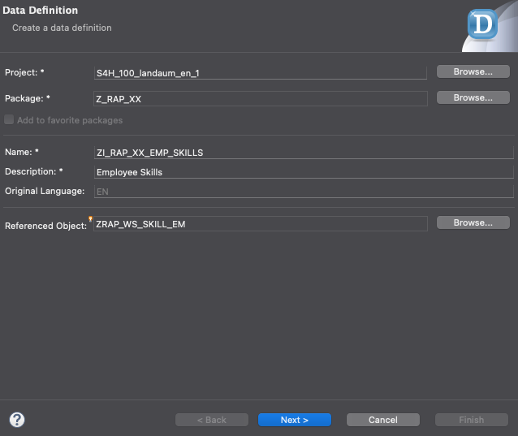
       <figcaption style="text-align:center;"><span style="color: red">XX durch die Nummer ersetzen</span></figcaption>
</figure>

Trage im Popup alle Daten gemäß dem Screenshot ein. Achte hierbei wieder darauf "XX" mit deiner Nummer zu ersetzen! Nach Eingabe der Informationen bitte nur auf "Next" und NICHT auf "Finish" klicken!
Denn auch hier können wir bestimmen welches Template wir generieren lassen wollen. Wähle hier unter dem Reiter View "defineViewEntity" aus. 


<figure style="border:1px solid #aaa; padding:10px; display:inline-block;">
  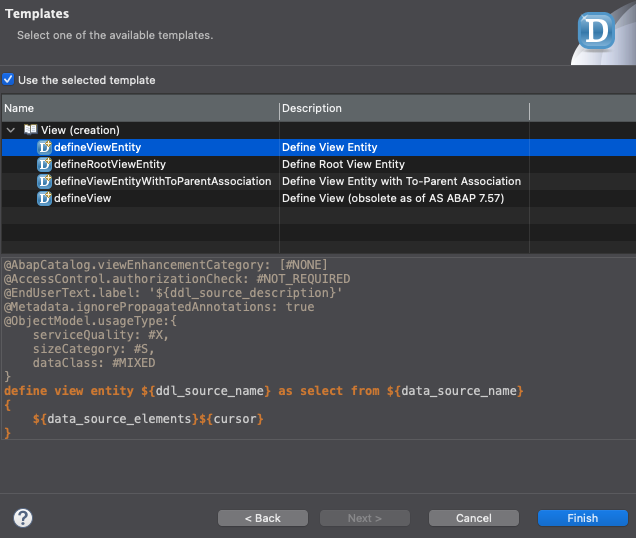
</figure>

- defineVIEW (DDIC-basierte CDS-Views) ist der ältere Befehl und hat bestimmte Einschränkungen. Bei der Aktivierung wird eine CDS-verwaltete DDIC-View generiert, die zu Performanceeinbußen führen
- definedViewEntity (CDS-View-Entitäten) ist eine moderne (ABAP 7.57) und von SAP empfohlene Variante mit technischen Verbesserungen. Das prägt sich besonders in einer Leistungsverbesserung aus und stellen einen agileren und flexibleren Ansatz für die Datenmodellierung dar. Zusätzlich gab es Vereinfachungen an der Syntax. Beispielsweise wird jetzt automatische eine SQL-Ansicht generiert, sodass diese nicht mehr über den Zusatz @AbapCatalog.sqlViewName definiert werden muss.

DDIC-basierte CDS-Views sind nicht ganz ausgestorben, da sie für einige ältere Funktionalitäten noch immer benötigt werden.

Durch die Generierung sind folgende Annotationen dazu gekommen:

|Annotation|Bedeutung|
|--|--|
|@ObjectModel.usageType.serviceQuality| Qualität des Service in Bezug auf die Leistung|
|@ObjectModel.usageType.sizeCategory| Größenkategorie der Daten|
|@ObjectModel.usageType.dataClass| Art der Daten|

Im Anschluss fügen wir ein paar leere Zeilen unter "Skill_start" ein und fügen den Kommentar //Administrative data hinzu.

<figure style="border:1px solid #aaa; padding:10px; display:inline-block;">
  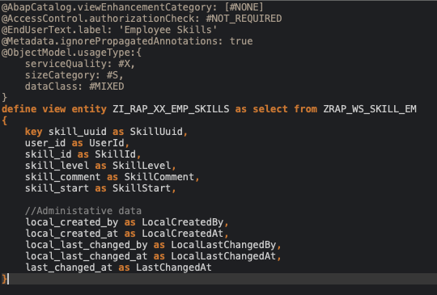
</figure>

Zudem fügen wir auch hier zu den Administrativen Daten die Annoationen hinzu.

    //Administrative data
    @Semantics.user.createdBy: true
    local_created_by      as LocalCreatedBy,
    @Semantics.systemDateTime.createdAt: true
    local_created_at      as LocalCreatedAt,
    @Semantics.user.lastChangedBy: true
    local_last_changed_by as LocalLastChangedBy,
    @Semantics.systemDateTime.lastChangedAt: true
    local_last_changed_at as LocalLastChangedAt,
    @Semantics.systemDateTime.localInstanceLastChangedAt: true
    last_changed_at       as LastChangedAt,

  Jetzt fehlt noch die Verknüpfung zum Parent. Dazu benötigen wir zusätzlich diese beiden Zeilen:

 >association to parent ZI_RAP_XX_EMPLOYEE as _Employee on $projection.UserId = _Employee.UserId

 >//Association <br>
    _Employee


  <figure style="border:1px solid #aaa; padding:10px; display:inline-block;">
  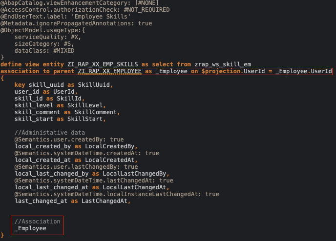
</figure>

Die Datei lässt sich zwar schon aktiv schalten, allerdings wird ZI_RAP_XX_EMPLOYEE noch unterstrichen. Das liegt daran, dass wir auch beim Parent noch das Child angeben müssen.

Bei einem Blick auf die ZI_RAP_XX_EMPLOYEE fällt auf, dass dort noch die beiden Zeilen von vorher auskommentiert sind. Genau dort geben wir jetzt die Verknüpfung zum Child an. Also tauschen wir die beiden:

>//composition of target_data_source_name as _association_name

>//_association_name <br>// Make association public

durch diese beiden aus:
>composition [0..*] of ZI_RAP_XX_EMP_SKILLS as _EmpSkills


>//Association <br>
    _EmpSkills


  <figure style="border:1px solid #aaa; padding:10px; display:inline-block;">
  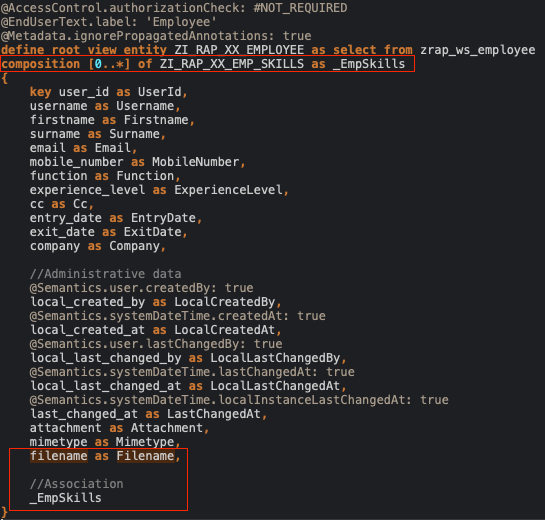
</figure>

> **Hinweis:** Nicht vergessen das Kommar hinter "Filename" wieder einzukommentieren.

#### 3.1.2 Consumption View anlegen

Anlagedaten der Consumption-View: 
- View-Name: ZC_RAP_XX_EMP_SKILLS
- Beschreibung: Employee Skills
- Referenz: ZI_RAP_XX_EMP_SKILLS
<br><br>

Wie zuvor auch erstellen wir die Consumption View mit einem Rechtsklick auf unserere Interface-View (ZI_RAP_XX_EMP_SKILLS) mit einem anschließenden Klick auf "New Data Definition".

<figure style="border:1px solid #aaa; padding:10px; display:inline-block;">
  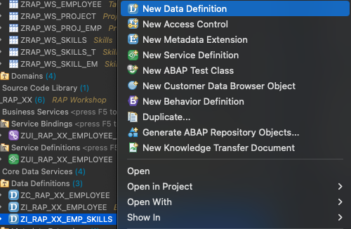
</figure>


<figure style="border:1px solid #aaa; padding:10px; display:inline-block;">
  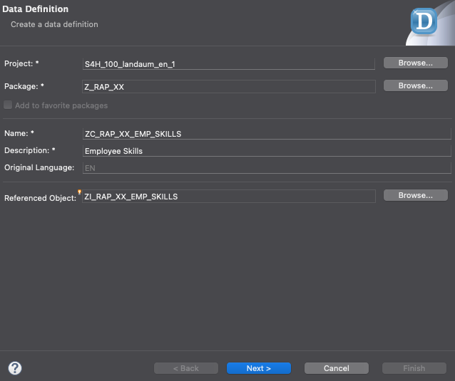
       <figcaption style="text-align:center;"><span style="color: red">XX durch die Nummer ersetzen</span></figcaption>
</figure>


Trage im Popup alle Daten gemäß dem Screenshot ein. Achte hierbei wieder darauf "XX" mit deiner Nummer zu ersetzen! Nach Eingabe der Informationen bitte nur auf "Next" und NICHT auf "Finish" klicken!
Denn auch hier können wir bestimmen welches Template wir generieren lassen wollen. Wähle hier unter dem Reiter View "defineProjectionView" aus. 


<figure style="border:1px solid #aaa; padding:10px; display:inline-block;">
  
</figure>

Auch hier ergänzen wir die Beziehung zum Parent.

<figure style="border:1px solid #aaa; padding:10px; display:inline-block;">
  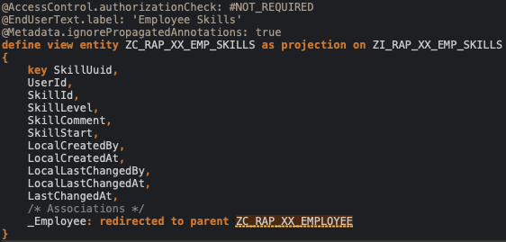
</figure>

Analog zu vorher erscheint hier der Warnhinweis, das die Verbindung noch im Parent fehlt. Deshalb wechseln wir jetzt in die ZC_RAP_XX_EMPLOYEE Consumption-View und füge diese dort hinzu. 

<figure style="border:1px solid #aaa; padding:10px; display:inline-block;">
  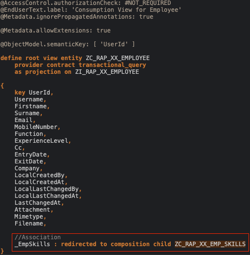
</figure>

### 3.2. UI Annotationen anlegen

Anlagedaten der Metadaten: 
- Paket: Z_RAP_XX
- Name: ZC_RAP_XX_EMP_SKILLS
- Beschreibung: Skills Metadata Extention
- Erweiterte Entität: ZC_RAP_XX_EMP_SKILLS

> **Hinweis:**  Ergänze die Annotation '@Metadata.allowExtensions: true' in der Consumption View (ZC_RAP_XX_EMP_SKILLS).

Lege im Anschluss eine Metadata Exension mit einem Rechtsklick auf ZC_RAP_XX_EMP_SKILLS.

<figure style="border:1px solid #aaa; padding:10px; display:inline-block;">
  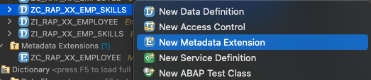
</figure>

Die Metadata Extension trägt wieder genau den gleichen namen wie die Consumption-View (ZC_RAP_XX_EMP_SKILLS).

<figure style="border:1px solid #aaa; padding:10px; display:inline-block;">
  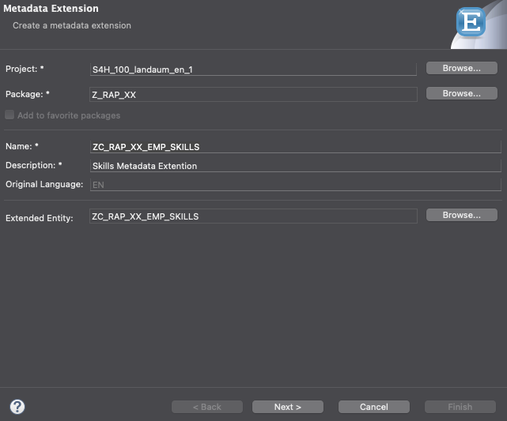
       <figcaption style="text-align:center;"><span style="color: red">XX durch die Nummer ersetzen</span></figcaption>
</figure>

Trage im Popup alle Daten gemäß dem Screenshot ein. Achte hierbei wieder darauf "XX" mit deiner Nummer zu ersetzen! Nach Eingabe der Informationen bitte nur auf "Next" und NICHT auf "Finish" klicken!
Denn auch hier können wir bestimmen welches Template wir generieren lassen wollen. Wähle hier unter dem Reiter Annotate Entity "annotateEntity" aus. 

 <figure style="border:1px solid #aaa; padding:10px; display:inline-block;">
  
</figure>

Ändere in der neu generierten Datei ZC_RAP_XX_EMP_SKILLS wieder die Metadata.layer zu '#CORE' und füge die Ui-Elemente hinzu, sodass die Datei am Ende so aussieht:

      @Metadata.layer: #CORE

      annotate entity ZC_RAP_XX_EMP_SKILLS
        with 
    {
        @UI.facet: [
          {
            id: 'idIdentification',
            type: #IDENTIFICATION_REFERENCE,
            label: 'Skills',
            position: 10
          }
        ]

        @UI.hidden: true
        SkillUuid;

        @UI.hidden: true
        userId;

       //@Consumption.valueHelpDefinition: [{ entity: {name:      'ZI_RAP_XX_SKILLS_VH', element: 'SkillId' } }]
        @UI: { lineItem: [{ position: 30 }],
              identification: [{ position: 30 }],
              textArrangement: #TEXT_ONLY }
        SkillId;

        //@Consumption.valueHelpDefinition: [{ entity: { name:    'ZI_RAP_XX_SKILL_LEVEL_VH', element: 'SkillLevel' } }]

        @UI: {
          lineItem: [{ position: 50 }],
          identification: [{ position: 40 }],
          textArrangement: #TEXT_FIRST
        }
        SkillLevel;

        @UI: { lineItem: [{ position: 50 }],
              identification: [{ position: 50 }] }
        SkillStart;

        @UI: { lineItem: [{ position: 60 }],
            identification: [{ position: 60 }] }
        @UI.multiLineText: true
        SkillComment;

        @UI: {
              identification: [{ position: 70 }] }
        LocalCreatedBy;

        @UI: {
              identification: [{ position: 80 }] }
        LocalCreatedAt;

        @UI: {
              identification: [{ position: 90 }] }
        LocalLastChangedBy;

        @UI: {
              identification: [{ position: 100 }] }
        LocalLastChangedAt;

        @UI: {
              identification: [{ position: 110 }] }
        LastChangedAt;
      }

### 3.3. Erweiterung der Service Definition
In der Service Definition die Consumption View für ZC_RAP_XX_EMP_SKILLS ergänzen:

    expose ZC_RAP_XX_EMP_SKILLS as EmpSkills;

Nun kann man sich auch die Entität "EmpSkills" in der Preview ansehen.

## 4. Teil: Zweite Kindsentität anlegen (Hands on)
### 4.1 Interface View für 2. Kindsentität anlegen
Anlagedaten der Interface-View: 
- View-Name: ZI_RAP_XX_PROJ_EMP
- Beschreibung: Employee Projects
- Referenz: ZRAP_WS_PROJ_EMP

Erstelle mit einem Rechtsklick auf Data Definitions und dann New Data Definition.

<figure style="border:1px solid #aaa; padding:10px; display:inline-block;">
  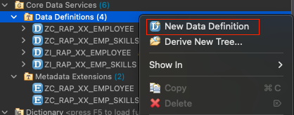
</figure>

<figure style="border:1px solid #aaa; padding:10px; display:inline-block;">
  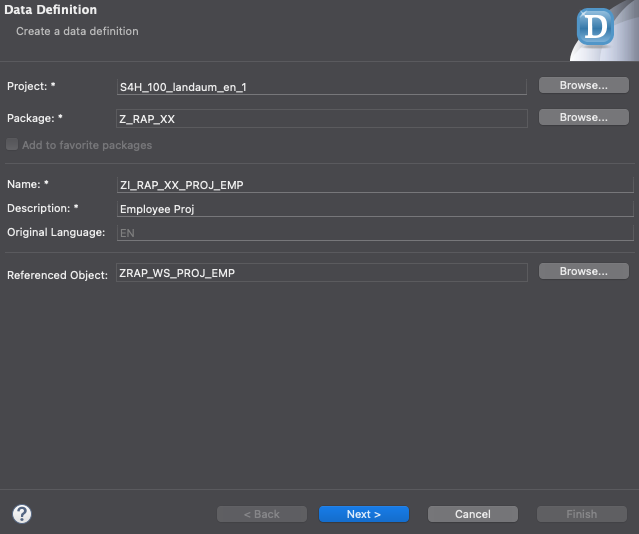
       <figcaption style="text-align:center;"><span style="color: red">XX durch die Nummer ersetzen</span></figcaption>
</figure>

Trage im Popup alle Daten gemäß dem Screenshot ein. Achte hierbei wieder darauf "XX" mit deiner Nummer zu ersetzen! Nach Eingabe der Informationen bitte nur auf "Next" und NICHT auf "Finish" klicken!
Denn auch hier können wir bestimmen welches Template wir generieren lassen wollen. Wähle hier unter dem Reiter View  "defineViewEntity" aus. 

<figure style="border:1px solid #aaa; padding:10px; display:inline-block;">
  
</figure>

Im Anschluss fügen wir ein paar leere Zeilen unter "workload" ein und fügen den Kommentar //Administrative data hinzu.

<figure style="border:1px solid #aaa; padding:10px; display:inline-block;">
  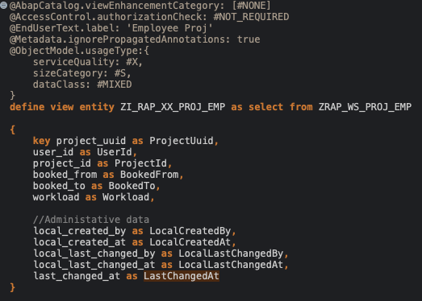
</figure>

Zudem fügen wir auch hier zu den Administrativen Daten die Annoationen hinzu.

    //Administrative data
    @Semantics.user.createdBy: true
    local_created_by      as LocalCreatedBy,
    @Semantics.systemDateTime.createdAt: true
    local_created_at      as LocalCreatedAt,
    @Semantics.user.lastChangedBy: true
    local_last_changed_by as LocalLastChangedBy,
    @Semantics.systemDateTime.lastChangedAt: true
    local_last_changed_at as LocalLastChangedAt,
    @Semantics.systemDateTime.localInstanceLastChangedAt: true
    last_changed_at       as LastChangedAt,

  Jetzt fehlt noch die Verknüpfung zum Parent. Dazu benötigen wir zusätzlich diese beiden Zeilen:

 >association to parent ZI_RAP_XX_EMPLOYEE as _Employee on $projection.UserId = _Employee.UserId

 >//Association <br>
    _Employee
<figure>
      <figure style="border:1px solid #aaa; padding:10px; display:inline-block;">
  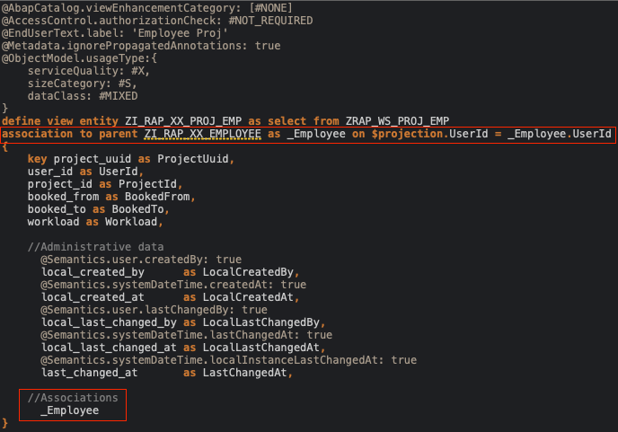
</figure>

Die Datei lässt sich zwar schon aktiv schalten, allerdings wird ZI_RAP_XX_EMPLOYEE noch unterstrichen. Das liegt daran, dass wir auch beim Parent noch das Child angeben müssen.

Deshalb fügen wir jetzt noch in der ZI_RAP_XX_EMPLOYEE folgende Zeilen hinzu:

>composition [0..*] of ZI_RAP_XX_PROJ_EMP as _EmpProj


>_EmpProj


  <figure style="border:1px solid #aaa; padding:10px; display:inline-block;">
  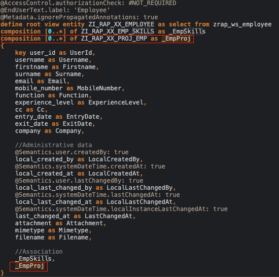
</figure>


### 4.2 Consumption View für 2. Kindsentität anlegen

Anlagedaten der Consumption-View: 
- View-Name: ZC_RAP_XX_PROJ_EMP
- Beschreibung: Employee Projects
- Referenz: ZI_RAP_XX_PROJ_EMP
<br><br>

Wie zuvor auch erstellen wir die Consumption View mit einem Rechtsklick auf unserere Interface-View (ZI_RAP_XX_PROJ_EMP) mit einem anschließenden Klick auf "New Data Definition".

<figure style="border:1px solid #aaa; padding:10px; display:inline-block;">
  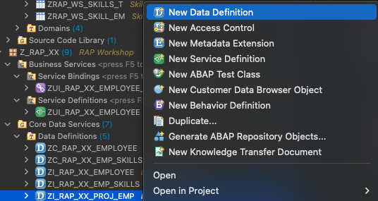
</figure>


<figure style="border:1px solid #aaa; padding:10px; display:inline-block;">
  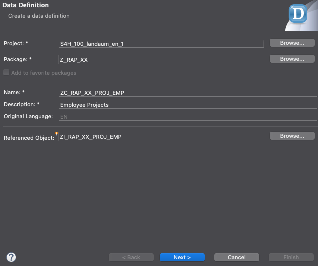
       <figcaption style="text-align:center;"><span style="color: red">XX durch die Nummer ersetzen</span></figcaption>
</figure>


Trage im Popup alle Daten gemäß dem Screenshot ein. Achte hierbei wieder darauf "XX" mit deiner Nummer zu ersetzen! Nach Eingabe der Informationen bitte nur auf "Next" und NICHT auf "Finish" klicken!
Denn auch hier können wir bestimmen welches Template wir generieren lassen wollen. Wähle hier unter dem Reiter View "defineProjectionView" aus. 


<figure style="border:1px solid #aaa; padding:10px; display:inline-block;">
  
</figure>

Auch hier ergänzen wir die Beziehung zum Parent.

<figure style="border:1px solid #aaa; padding:10px; display:inline-block;">
  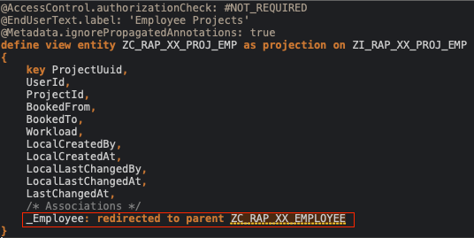
</figure>

Analog zu vorher erscheint hier der Warnhinweis, das die Verbindung noch im Parent fehlt. Deshalb wechseln wir jetzt in die ZC_RAP_XX_EMPLOYEE Consumption-View und füge diese dort hinzu. 

<figure style="border:1px solid #aaa; padding:10px; display:inline-block;">
  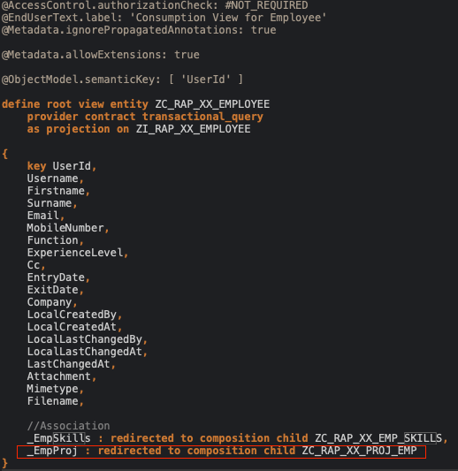
</figure>


### 4.3 UI Annotationen anlegen

Anlagedaten der Metadaten: 
- Paket: Z_RAP_XX
- Name: ZC_RAP_XX_Proj_EMP
- Beschreibung: Skills Metadata Extention
- Erweiterte Entität: ZC_RAP_XX_Proj_EMP

> **Hinweis:**  Ergänze die Annotation '@Metadata.allowExtensions: true' in der Consumption View (ZC_RAP_XX_PROJ_EMP).

Lege im Anschluss eine Metadata Exension mit einem Rechtsklick auf ZC_RAP_XX_PROJ_EMP.

<figure style="border:1px solid #aaa; padding:10px; display:inline-block;">
  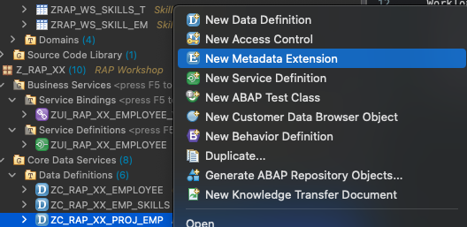
</figure>

Die Metadata Extension trägt wieder genau den gleichen namen wie die Consumption-View (ZC_RAP_XX_PROJ_EMP).

<figure style="border:1px solid #aaa; padding:10px; display:inline-block;">
  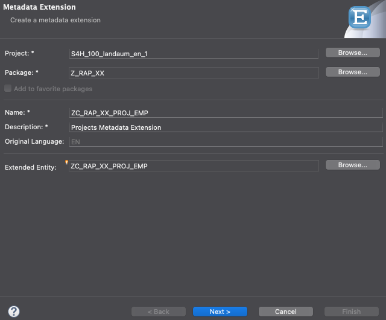
       <figcaption style="text-align:center;"><span style="color: red">XX durch die Nummer ersetzen</span></figcaption>
</figure>

Trage im Popup alle Daten gemäß dem Screenshot ein. Achte hierbei wieder darauf "XX" mit deiner Nummer zu ersetzen! Nach Eingabe der Informationen bitte nur auf "Next" und NICHT auf "Finish" klicken!
Denn auch hier können wir bestimmen welches Template wir generieren lassen wollen. Wähle hier unter dem Reiter Annotate Entity "annotateEntity" aus. 

 <figure style="border:1px solid #aaa; padding:10px; display:inline-block;">
  
</figure>

Ändere in der neu generierten Datei ZC_RAP_XX_PROJ_EMP wieder die Metadata.layer zu '#CORE' und füge die Ui-Elemente hinzu, sodass die Datei am Ende so aussieht:

    @Metadata.layer: #CORE
        annotate entity ZC_RAP_XX_PROJ_EMP with 
    {
          @UI.facet: [
              {
                id: 'idIdentification',
                type: #IDENTIFICATION_REFERENCE,
                label: 'Project',
                position: 10
              }
          ]

      @UI.lineItem: [{ position: 100, type: #FOR_ACTION, dataAction: 'quitProject', label : 'Projekt verlassen zum' }]
      @UI.hidden: true
      UserId;

    // @Consumption.valueHelpDefinition: [{ entity: {name:         'ZI_RAP_XX_PROJ_VH', element: 'ProjectId' } }]
      @UI: { lineItem: [{ position: 11 }],
            identification: [{ position: 11 }],
            textArrangement: #TEXT_ONLY }
      ProjectId;

      @UI: { lineItem: [{ position: 20 }],
            identification: [{ position: 20 }] }
      BookedFrom;

      @UI: { lineItem: [{ position: 30 }],
            identification: [{ position: 30 }] }
      BookedTo;

      @UI: { lineItem: [{ position: 40 }],
            identification: [{ position: 40 }] }
      Workload;

      @UI: { identification: [{ position: 50 }] }
      LocalCreatedBy;

      @UI: { identification: [{ position: 60 }] }
      LocalCreatedAt;

      @UI: { identification: [{ position: 70 }] }
      LocalLastChangedBy;

      @UI: { identification: [{ position: 80 }] }
      LocalLastChangedAt;

      @UI: { identification: [{ position: 90 }] }
      LastChangedAt;

    }

### 4.3. Erweiterung der Service Definition
In der Service Definition die Consumption View für ZC_RAP_XX_PROJ_EMP ergänzen:

expose ZC_RAP_XX_PROJ_EMP  as EmpProjects;

Nun kann man sich auch die Entität "EmpProjects" in der Preview ansehen.

## 5. Teil: Kindsentitäten in der UI Annotation der Elternentität hinzufügen
### 5.1 Teil: Facets
Facets dienen der Strukturierung und Grupperiung von Daten. Es gibt verschiedene Facet-Typen, die man per Annotation festlegen kann:
- #IDENTIFICATION_REFERENCE → zeigt eine Gruppe von Feldern (ähnlich „Allgemeine Daten“).
- #FIELDGROUP_REFERENCE → verweist auf eine Feldgruppe.
- #LINEITEM_REFERENCE → verweist auf eine Tabellenansicht (z. B. Positionen zu einem Auftrag).
- #CHART_REFERENCE → Einbetten eines Diagramms.
- #FORM_REFERENCE → Formular-Abschnitt.
- #CONTACT_REFERENCE → spezieller Abschnitt für Ansprechpartner.
- #HEADERINFO → Infos im Header-Bereich der Object Page.
- #COLLECTION → Tab/Collection, die mehrere Facets zusammenfasst. <br><br>

Füge als erstes die Collection innerhalb des @UI.facet hinzu. Am Besten über dem Personal Data Facet und ergänze dann dort die parentId 'CollectionsEmployee'.


<figure style="border:1px solid #aaa; padding:10px; display:inline-block;">
  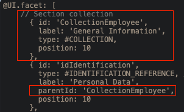
</figure>

Ergänze anschließend noch die restlichen Sections, sodass die Datei am Ende so aussieht:
    @Metadata.layer: #CORE

    @UI: {
      presentationVariant: [{ requestAtLeast: ['UserId'] }]
    }
    annotate entity ZC_RAP_XX_EMPLOYEE with
    {
    
      //Sections
    @UI.facet: [
        // Section collection
          { id: 'CollectionEmployee',
            label: 'General Information',
            type: #COLLECTION,
            position: 10
          },
          { id: 'idIdentification',
            type: #IDENTIFICATION_REFERENCE, /* Refers to elements annotated with '@UI.identification' */
            label: 'Personal Data',
            parentId: 'CollectionEmployee',
            position: 10
          },
          { id: 'CompanyData',
            type: #FIELDGROUP_REFERENCE,
            label: 'Company Data',
            parentId: 'CollectionEmployee',
            targetQualifier: 'CompanyData',
            position: 20
          },

      // Section: Date
      { id: 'Dates',
        type: #FIELDGROUP_REFERENCE,
        label: 'Dates',
        targetQualifier: 'Dates',
        position: 20
      },

      // Entity Reference
      { id: 'Skills',
        type: #LINEITEM_REFERENCE, /* Refers to the lineitems of the entity*/
        label: 'Skills',
        targetElement: '_EmpSkills',
        position: 30
      },
      { id: 'Projects',
        type: #LINEITEM_REFERENCE,
        label: 'Projects',
        targetElement: '_EmpProj',
        position: 40
      } 
     ]
     
      // Personal data
      @UI.hidden: true
      UserId;

      @UI.lineItem: [{ position: 10, importance: #MEDIUM } ]
      @UI.identification: [ { position: 30 } ]
      Username;

      @UI.lineItem: [ { position: 20, importance: #MEDIUM } ]
      @UI.identification: [ { position: 10 } ]
      @UI.selectionField: [{ position: 10 }]
      Surname;

      @UI.lineItem: [ { position: 30, importance: #MEDIUM } ]
      @UI.identification: [ { position: 20 } ]
      @UI.selectionField: [{ position: 20 }]
      Firstname;
    }
    
    
    


### 5.1 Teil: Weitere Felder

Füge unterhalb von "Firstname" folgende Felder hinzu:

      @UI.lineItem: [ { position: 40, importance: #MEDIUM } ]
      @UI.identification: [ { position: 40 } ]
      Email;

      @UI.lineItem: [ { position: 50, importance: #MEDIUM } ]
      @UI.identification: [ { position: 50 } ]
      MobileNumber;

      //Company
      //@Consumption.valueHelpDefinition: [ { entity: {name: 'ZI_RAP25_COMPANY_VH', element: 'Company' } } ]
      @UI.lineItem: [ { position: 60 , importance: #MEDIUM }]
      @UI.selectionField: [{ position: 60 }]
      @UI.fieldGroup: [{ qualifier: 'CompanyData', position: 10 }]
      @UI.textArrangement: #TEXT_ONLY
      Company;

      @UI.lineItem: [ { position: 70, importance: #MEDIUM } ]
      @UI.fieldGroup: [{ qualifier: 'CompanyData', position: 20 }]
      Cc;

      //@Consumption.valueHelpDefinition: [{ entity: { name:    'ZI_RAP25_Function_Text', element: 'Function' } }]
      @UI: { lineItem: [ { position: 80, importance: #MEDIUM } ],
            textArrangement: #TEXT_ONLY,
            fieldGroup: [{ qualifier: 'CompanyData', position: 30 }] }
      Function;

      //@Consumption.valueHelpDefinition: [{ entity: { name:    'ZI_RAP25_EXPERIENCE_TEXT', element: 'ExperienceLevel' } }]
      @UI: { lineItem: [ { position: 90, importance: #MEDIUM } ],
            fieldGroup: [{ qualifier: 'CompanyData', position: 40 }],
            textArrangement: #TEXT_ONLY }
      ExperienceLevel;


      //Dates
      @UI: { lineItem: [ { position: 100, importance: #MEDIUM } ],
          fieldGroup: [{ qualifier: 'Dates', position: 10 }] }
      EntryDate;

      @UI: { lineItem: [ { position: 110, importance: #MEDIUM } ],
            fieldGroup: [{ qualifier: 'Dates', position: 20 }] }
      ExitDate;

      Wenn wir jetzt auf die App schauen, sehen wir die neu dazugekommenen Sections und dass die Daten schön Strukturiert

## 6 Verhaltensdefinition
Bis jetzt haben wir reine Datenmodellierung betrieben. Über eine Behavior Definition können wir das Verhalten von CDS-basierten Business-Objekten steuern. Das heißt wir gehen weg von der reinen Anzeige, damit mehr Leben in die App kommt.

Mit Create, Update, Delete, Action, Determination, Validation können wir definieren, was ein Objekt alles kann. 

### 6.1 Verhaltensdefinition Interface anlegen

Diese legen  wir mit einem Rechtsklick auf die Data Definition ZI_RAP_XX_EMPLOYEE und dann auf "New Behavior Definition" an. 

<figure style="border:1px solid #aaa; padding:10px; display:inline-block;">
  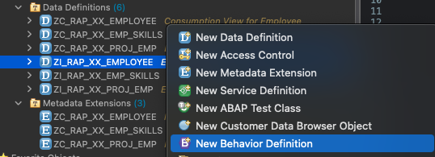
</figure>

Im Popup muss nichts geändert werden. Alle Daten müssten schon vorausgefüllt sein.

<figure style="border:1px solid #aaa; padding:10px; display:inline-block;">
  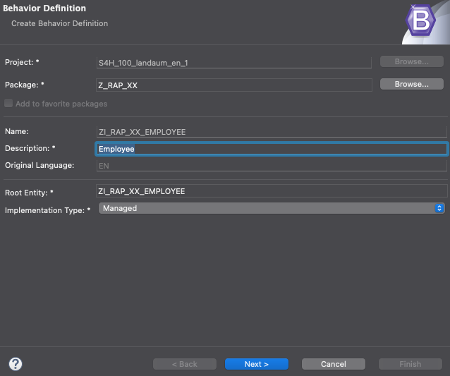
       <figcaption style="text-align:center;"><span style="color: red">XX durch die Nummer ersetzen</span></figcaption>
</figure>

Nach dem generieren der Datei ist einges gelb und rot Markiert. Das soll uns erstmal nicht stören.

#### 6.1.1 Alias hinzufügen:


  - Employee
  - EmplProjects
  - EmplSkills


Trage den jeweiligen Alias anstatt des Kommentars ein.

>//alias <alias_name> 

Das ganze sieht dann so aus:


#### 6.1.2 Mapping Service mit DB
Zuordnung der CDS-View-Element-Namen zu den in der persistenten Tabelle verwendeten Namen.

<figure style="border:1px solid #aaa; padding:10px; display:inline-block;">
  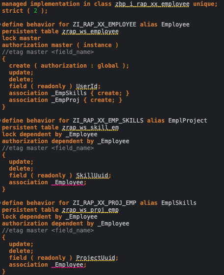
</figure>

#### 6.1.2 Mapping Service mit DB
Zuordnung der CDS-View-Element-Namen zu den in der persistenten Tabelle verwendeten Namen.
Wir fügen also folgendes unter die Zeile "association _Proj { create; }":


      mapping for zrap_ws_employee
        {
          UserUuid           = user_uuid;
          Username           = username;
          Firstname          = firstname;
          Surname            = surname;
          Email              = email;
          MobileNumber       = mobile_number;
          Function           = function;
          ExperienceLevel    = experience_level;
          Cc                 = cc;
          EntryDate          = entry_date;
          ExitDate           = exit_date;
          Company            = company;
          LocalCreatedBy     = local_created_by;
          LocalCreatedAt     = local_created_at;
          LocalLastChangedBy = local_last_changed_by;
          LocalLastChangedAt = local_last_changed_at;
          LastChangedAt      = last_changed_at;
          Attachment         = attachment;
          Mimetype           = mimetype;
          Filename           = filename;
        }

Das gleiche machen wir für Skills unter die Zeile "association _Employee;":

      mapping for ZRAP_WS_skill_em
      {
        SkillUuid          = skill_uuid;
        SkillId            = skill_id;
        SkillLevel         = skill_level;
        SkillStart         = skill_start;
        SkillComment       = skill_comment;
        UserId             = user_id;
        LocalCreatedBy     = local_created_by;
        LocalCreatedAt     = local_created_at;
        LocalLastChangedBy = local_last_changed_by;
        LocalLastChangedAt = local_last_changed_at;
        LastChangedAt      = last_changed_at;
      }

Abschließend noch für Projects unter die Zeile "association _Employee;":

      mapping for zrap_ws_proj_emp
      {
        ProjectUuid        = project_uuid;
        UserId           = user_id;
        ProjectId          = project_id;
        BookedFrom         = booked_from;
        BookedTo           = booked_to;
        Workload           = workload;
        LocalCreatedBy     = local_created_by;
        LocalCreatedAt     = local_created_at;
        LocalLastChangedBy = local_last_changed_by;
        LocalLastChangedAt = local_last_changed_at;
        LastChangedAt      = last_changed_at;
      }

#### 6.1.3 Verhalten von Feldern
Schlüssel-Felder:
- **(numbering: managed)**: Das RAP-Framework erzeugt automatisch den Schlüsselwert.
- **(numbering: user)**: Der Benutzer (oder aufrufende Service) muss den Wert setzen.
- **(numbering: none**):Es gibt keine automatische Nummernvergabe. Die Nummernvergabe muss über die Behavior Implementation implementiert werden.

Wir möchten eine automatische Vergabe unserer Key-Felder. Zusätzlich sollen z. B. technische Felder wie 'Angelegt von' nicht bearbeitbar sein. Dass heißt wir müssen folgendes ergänzen:

Employee:

>field ( readonly ) UserId;

wird zu:
>field ( numbering : managed, readonly ) UserId;

<figure style="border:1px solid #aaa; padding:10px; display:inline-block;">
  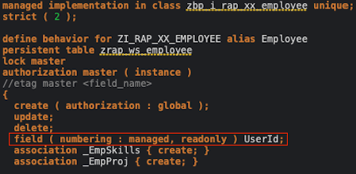
</figure>

Skills_

>field ( readonly ) SkillUuid;

wird zu:
<figure style="border:1px solid #aaa; padding:10px; display:inline-block;">
  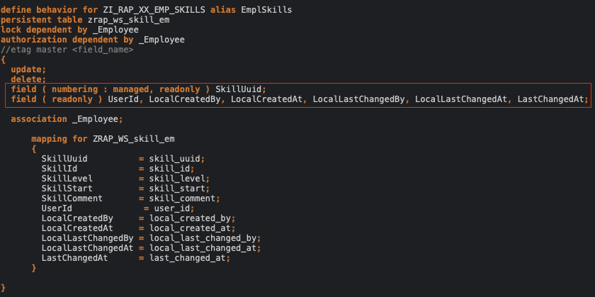
</figure>

Projects:

>field ( readonly ) ProjectUuid;

wird zu:
<figure style="border:1px solid #aaa; padding:10px; display:inline-block;">
  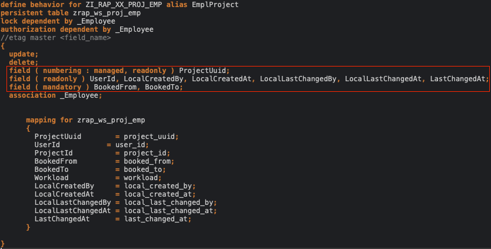
</figure>

Jetzt sollte auch die roten Fehler unter _Employee verschwunden sein.

### 6.2 Verhaltensdefinition Consumption anlegen
Auch hier legen wir eine Consumption-View an. Dazu einen Rechtsklick auf die Data Definition ZC_RAP_XX_EMPLOYEE und ein Klick auf New Behavior Definition.

<figure style="border:1px solid #aaa; padding:10px; display:inline-block;">
  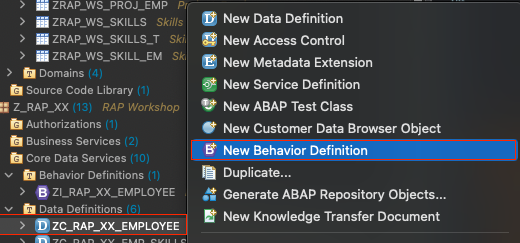
</figure>

Hier muss im Popup ebenfalls nichts geändert werden. Es sollten hier auch wieder alle Felder ausgefüllt sein.

<figure style="border:1px solid #aaa; padding:10px; display:inline-block;">
  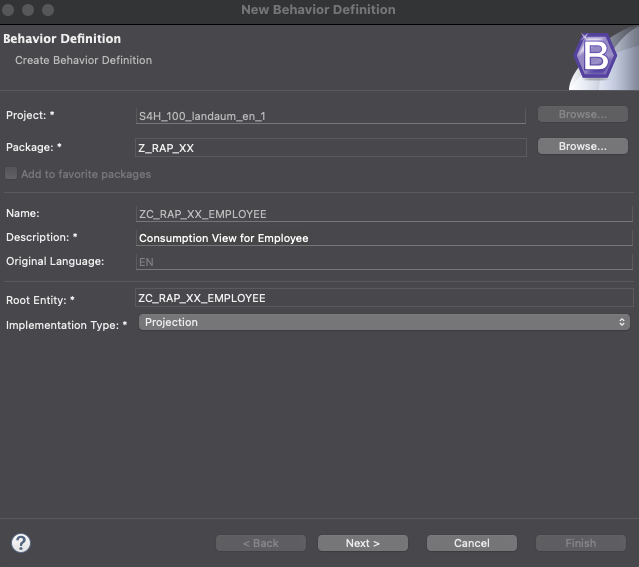

</figure>

Hier passen wir auch wieder den Alias von Employee, Skills und Projekte an.

<figure style="border:1px solid #aaa; padding:10px; display:inline-block;">
  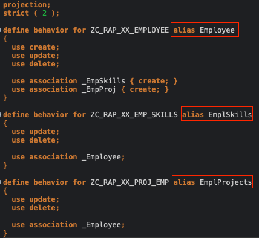
</figure>

### 6.3 Anpassung der Interface Verhaltensdefinition mit Draft 

- **etag master** : Versionskontrolle von Datensätzen. Wenn ein Benutzer einen Datensatz liest und später wieder ändert, prüft das System über den ETag, ob sich die Daten in der Zwischenzeit geändert haben.
- **lock master total etag**: Etag für das gesamte Business-Objekt → Jede Änderung am Root oder an Child-Entities aktualisiert den ETag des Root.

**Draft Actions** sind spezielle Aktionen im Zusammenhang mit Drafts.

- draft action Activate:
  - Wandelt den Draft in ein aktives BO um (z. B. aus einem Entwurf eines Auftrags wird der „echte“ Auftrag).
  - Währenddessen werden Prüfungen, Determinationen und ggf. weitere Aktionen ausgeführt.

- draft action Edit: 
  - Erstellt einen Draft aus einem bestehenden aktiven BO.

- draft action Discard
  - Löscht den Draft (ohne das aktive BO zu verändern).

- draft action Resume
  - Falls ein User einen Draft begonnen, aber nicht fertiggestellt hat → diese Draft-Session kann wiederaufgenommen werden. 

Für den Draft müssen wir alles vom folgenden Screenshot ergänzen

<figure style="border:1px solid #aaa; padding:10px; display:inline-block;">
  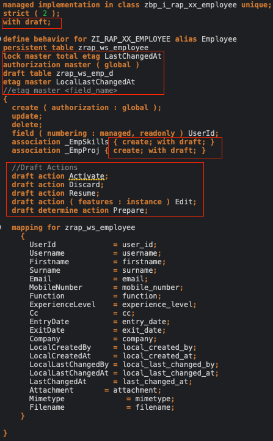
</figure>
<figure style="border:1px solid #aaa; padding:10px; display:inline-block;">
  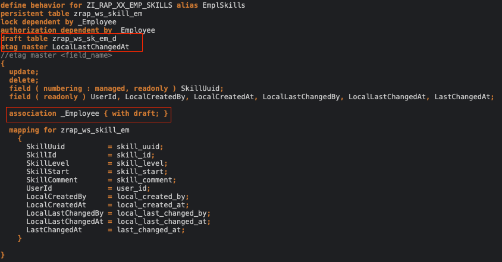
</figure>
<figure style="border:1px solid #aaa; padding:10px; display:inline-block;">
  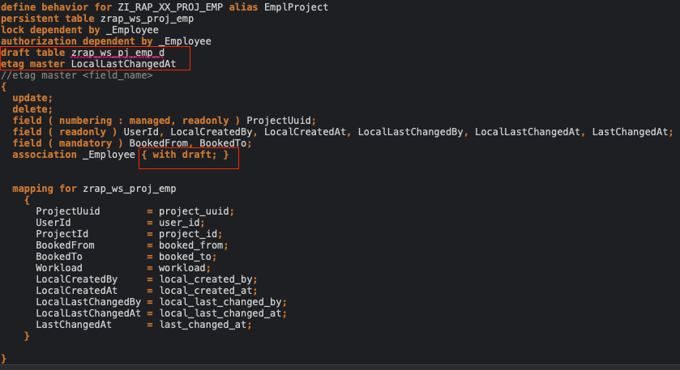
</figure>

Nachdem alle Informationen entsprechend der Screenshots angepasst wurden, legen wir noch die BO-Klasse zbp_i_rap_xx_employee an. Diese kann von Eclipse generiert werden. Klicke hierzu wieder links auf die Glühbirne in entsprechenden Zeile und dann im erscheinenden Popup auch auf der linken Seite einen Doppelklick

<figure style="border:1px solid #aaa; padding:10px; display:inline-block;">
  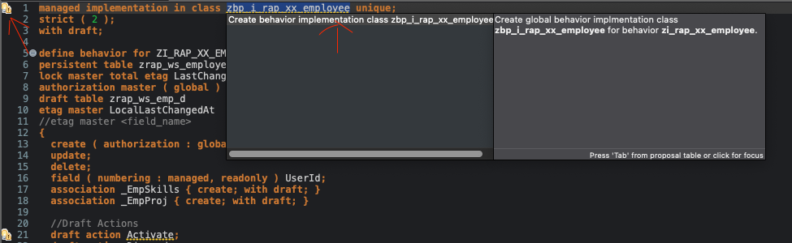
</figure>

Im nächsten Popup sollten wieder alle Daten vorausgefüllt sein.

<figure style="border:1px solid #aaa; padding:10px; display:inline-block;">
  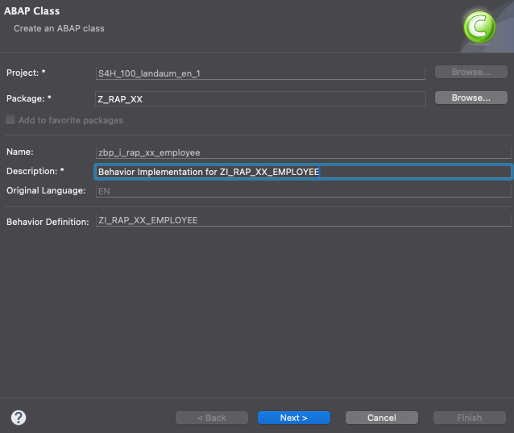
</figure>

Die Klasse sieht dann so aus:

<figure style="border:1px solid #aaa; padding:10px; display:inline-block;">
  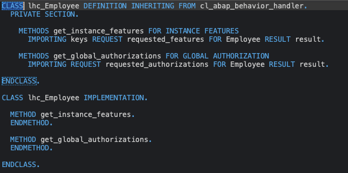
</figure>


### 6.4 Draft Tabellen erstellen (NICHT DURCHFÜHREN, KAPITEL 6.4 DIENT NUR ALS REINE INFORMATION)

>**WARNUNG!!!**<br>
Die Drafttabellen müssen innerhalb des Workshops nicht von allen Teilnehmern selbst angelegt werden. Alle greifen auf die bereits vom Präsentator erstellten Drafttabellen zu!!!!! Folgende Schritte zum erstellen der Draft Tabeles dienen nur zur allgemeinen Information.

Draft Tabellen können wir manuell anlegen oder uns einfach von Eclipse erstellen lassen. Um sich eine Tabelle erstellen zu lassen, klickt man auf die Glühbirne am linken Rand von der entsprechenden Tabelle die noch rot markiert ist.

<figure style="border:1px solid #aaa; padding:10px; display:inline-block;">
  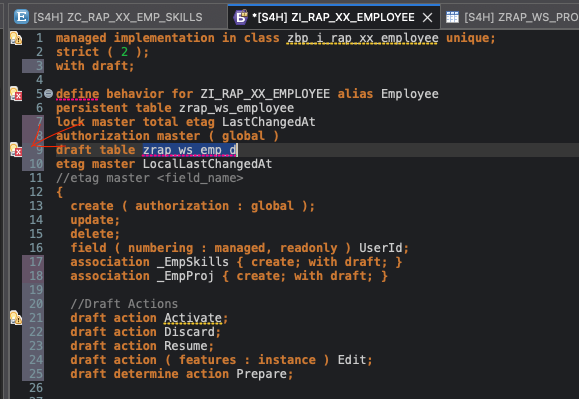
</figure>

Dann Doppelklick auf der linken Seite des Popups.

<figure style="border:1px solid #aaa; padding:10px; display:inline-block;">
  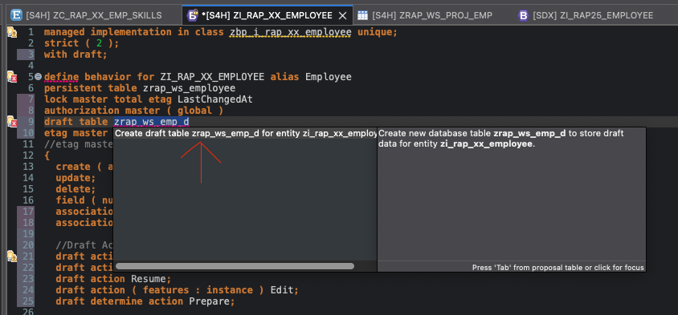
</figure>

Darauf hin erscheint ein altbekanntes Popup zum Anlegen neuer Elemente.
<figure style="border:1px solid #aaa; padding:10px; display:inline-block;">
  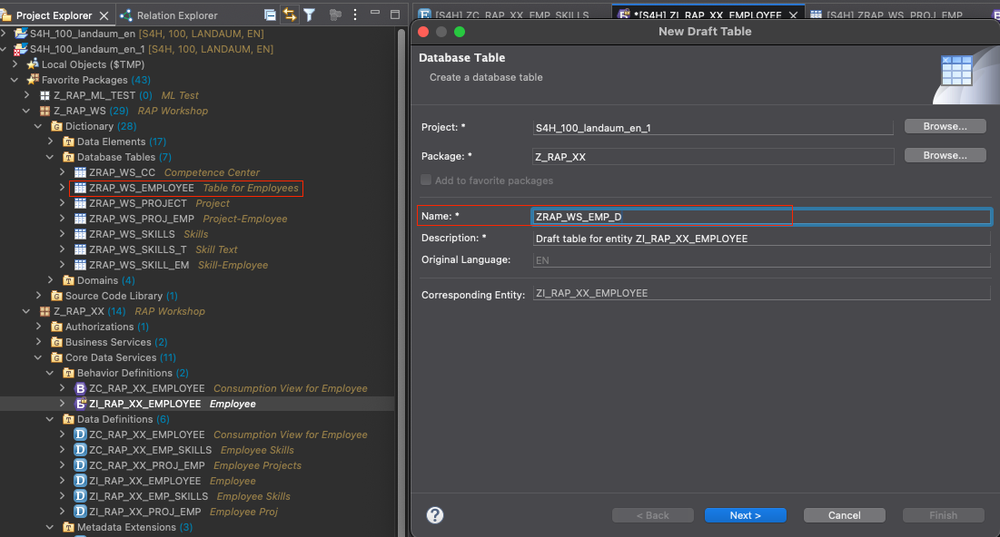
       <figcaption style="text-align:center;"><span style="color: red">XX durch die Nummer ersetzen</span></figcaption>
</figure>

Am Besten ist es, wenn man die Drafttabelle genau so benennt, wie auch die dazugehörige Tabellen plus "_D" am Ende. In diesem Beispiel wäre es aber leider durch Begrenzung der maximalen Zeichen für Tabellennamen (16 Zeichen) nicht möglich. Deshalb kürzen wir EMPLOYEE mit EMP ab.

Falls es nicht möglich ist, die Drafttabelle anlegen zu lassen, kann auch einfach die Datenbanktabelle dupliziert und umbenannt werden.

>**HINWEIS:** Auf diesem Wege muss noch folgendes bei der Drafttabelle ergänz werden:

Darauf hin erscheint ein altbekanntes Popup zum Anlegen neuer Elemente.
<figure style="border:1px solid #aaa; padding:10px; display:inline-block;">
  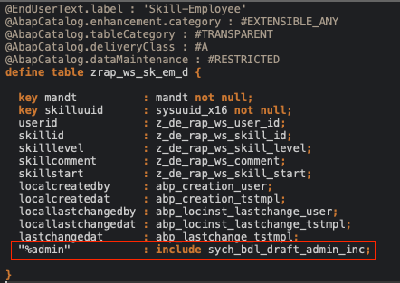
</figure>

>**Warnung Ende!!!**

### 6.4 Anpassung der Consumption Verhaltensdefinition mit Draft 

Jetzt fügen wir noch ein paar Draft Elemente in der Consumption-View der Behavior Definition (ZC_RAP_XX_EMPLOYEE) hinzu.

<figure style="border:1px solid #aaa; padding:10px; display:inline-block;">
  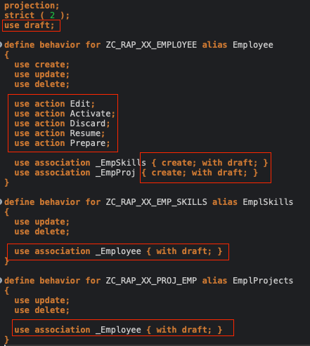
</figure>

Jetzt können wir uns den Draft in der App anschauen und Daten verändern.

### 6.5 Virenscrann (NICHT DURCHFÜHREN, KAPITEL 6.5 DIENT NUR ALS REINE INFORMATION)

Aufgrund des Attachment versucht SAP einen Virenscan auszuführen. Deshalb kann folgende Meldung erschreinene, wenn etwas im Draft Modus geändert/gespeichert wird:

<figure style="border:1px solid #aaa; padding:10px; display:inline-block;">
  
</figure>

Wenn dies der Fall ist, öffne die Transaktion "VSCANPROFILE" und aktiviere dort das entsprechende Profil.

## 7. Teil Erweiterung der UI Annotationen 
### 7.1 Build-In Funktionen
Build-In-Funktionen sind vordefinierte Funktionen, die direkt in einer CDS-View-Definition genutzt werden können ( ähnlich der SQL-Funktionen)

Beispiele:
- substring( name, 1, 3 ) → Teilstring
- round( amount, 2 ) → auf 2 Nachkommastellen runden
- cast( field as abap.int4 ) → Typumwandlung

Für unser Projekt wäre es schön einen 'Fullname' für den Header zu haben. Dazu ergänzen wir folgendes in der Employee Inferface-View ZI_RAP_XX_EMPLOYEE:

<figure style="border:1px solid #aaa; padding:10px; display:inline-block;">
  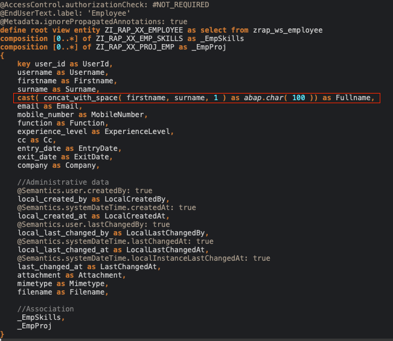
</figure>

Dann fügen wir Fullname noch in der Consumption-View ZC_RAP_XX_EMPLOYEE hinzu:

<figure style="border:1px solid #aaa; padding:10px; display:inline-block;">
  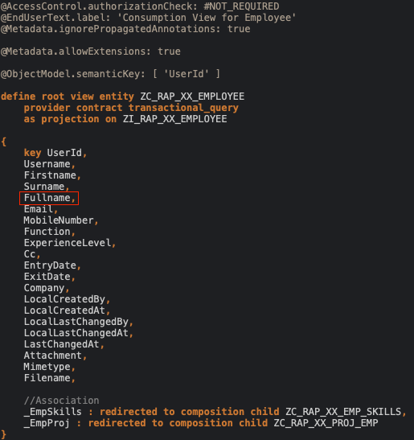
</figure>

Abschließend müssen wir noch die Kopfinformationen definieren. Dazu öffnen wir die Metadata Extension ZC_RAP_XX_EMPLOYEE und fügen folgendes Über der Zeile "  presentationVariant: [{ requestAtLeast: ['UserId'] }]" ein:
```
  headerInfo: {
                typeName: 'Employee',
                typeNamePlural: 'Employees',
                typeImageUrl: 'sap-icon://customer',
                title: { type:   #STANDARD,
                        value:  'Fullname',
                        label: 'Fullname'},
description: { type:   #STANDARD,
              value: 'Function'
}
},
```
In der Datei sollte es nun so aussehen:

<figure style="border:1px solid #aaa; padding:10px; display:inline-block;">
  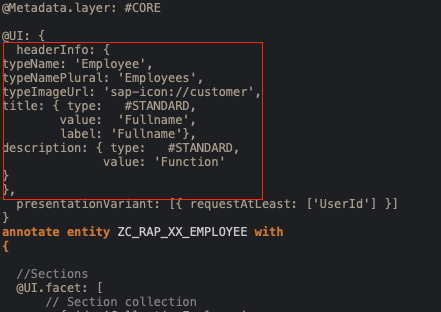
</figure>

Jetzt sehen wir in der Preview einen Kopf, der den vollen Namen zu der ausgewählten Person zeigt.

<figure style="border:1px solid #aaa; padding:10px; display:inline-block;">
  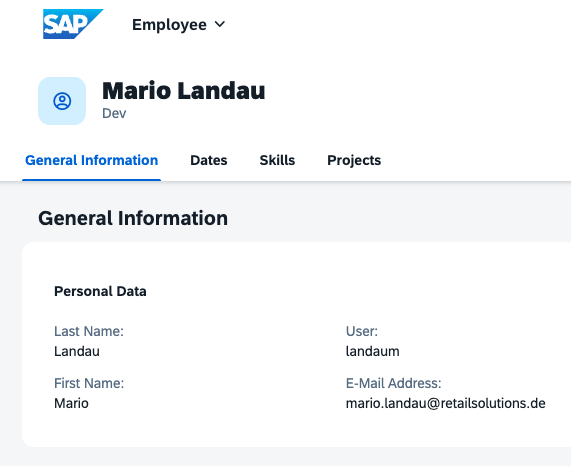
</figure>

### 7.2 Rating
Die Zahl bei dem Skill-Level tauschen wir jetzt durch ein Sternerating aus. Dazu öffnen wir die Metadata Extension ZC_RAP_XX_EMP_SKILLS. Dort suchen wir nach dem Feld "SkillLevel" und Tauschen dort die darüberstehenden Annonation aus.
```
  @UI: {
        dataPoint: {
                    qualifier: 'SkillLevel',
                    targetValue: 4,
                    visualization: #RATING
                   },
   lineItem: [{type: #AS_DATAPOINT,position: 40}],
   identification: [{ position: 40 }],
   textArrangement: #TEXT_FIRST
  }
  SkillLevel;
  ```

  <figure style="border:1px solid #aaa; padding:10px; display:inline-block;">
  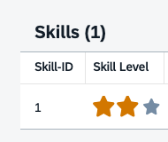
</figure>

### 7.3 Texte
Die in der Datenbanktabelle gespeicherten Daten sind für die User nicht immer verständlich. An manchen Stellen ist es daher wünschenwert statt dem Wert einen Text anzuzeigen, den dieser repräsentiert. Dazu müssen wir unsere CDS-Views mit Assoziationen anreichern, die diese Informationen beinhalten.

### 7.3.1 Domain Values (Information)
Inzwischen ist es nicht mehr erlaubt mit der CDS-View direkt auf die dd07T zuzugreifen. Stattdessen soll die CDS-View "DDCDS_CUSTOMER_DOMAIN_VALUE_T" verwendet werden. Dort wird allerdings ein Joing auf "ARS_OBJECTS_ALL_SW_COMP_SCP" gemacht. Diese Filtert zusätzlich die Komponenten. Dies kann schnell zu Problemen führen, da selbst wenn unsere Domain vorhanden ist und Werte in der dd07t gepflegt sind, kann es sein, dass die Domain in deinem Paket mit der falschen Komponente liegt (z.B. in einen $TMP Paket). Wenn dies der Fall ist, öffne die se80, navigiere zu deinem Paket und ändere die Softwarekomponente zu einer in der ARS_OBJECTS_ALL_SW_COMP_SCP vorhanden Komponente ab. Beispielsweise zu "ZCUSTOM_DEVELOPMENT".


<figure style="border:1px solid #aaa; padding:10px; display:inline-block;">
  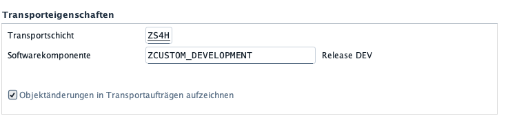
</figure>

### 7.3.2 Anlage Interface-View für Experience Text
Lege eine Interface-View ZI_RAP_EXPERIENCE_LEVEL_VH an. Klicke hierfür mit einem Rechtsklick auf Data Definitions und dann New Data Definition
<figure style="border:1px solid #aaa; padding:10px; display:inline-block;">
  
</figure>

Trage im Popup alle Daten gemäß dem Screenshot ein. Achte hierbei wieder darauf "XX" mit deiner Nummer zu ersetzen! Nach Eingabe der Informationen bitte nur auf "Next" und NICHT auf "Finish" klicken!
Denn auch hier können wir bestimmen welches Template wir generieren lassen wollen. Wähle hier unter dem Reiter View  "defineViewEntity" aus. 

<figure style="border:1px solid #aaa; padding:10px; display:inline-block;">
  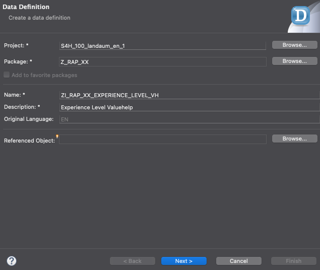
       <figcaption style="text-align:center;"><span style="color: red">XX durch die Nummer ersetzen</span></figcaption>
</figure>

Ergänze die Interview-View um folgende Zeilen:

<figure style="border:1px solid #aaa; padding:10px; display:inline-block;">
  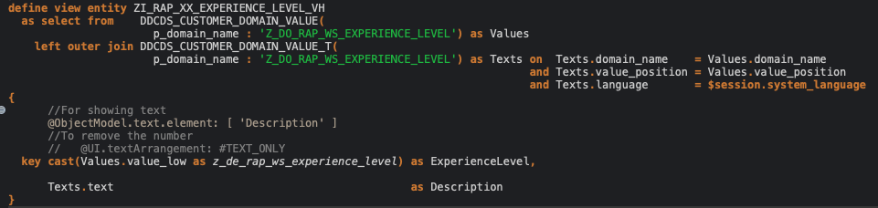
</figure>

Die auskommentierten Zeilen lassen wir auch erst einmal so.

Beim Ausführen der CDS-View sollten hier die Daten angezeigt werden. 
<figure style="border:1px solid #aaa; padding:10px; display:inline-block;">
  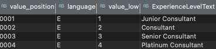
</figure>


Nun fügen wir noch die association in unserer Data Definition ZI_RAP_XX_EMPLOYEE hinzu.
<figure style="border:1px solid #aaa; padding:10px; display:inline-block;">
  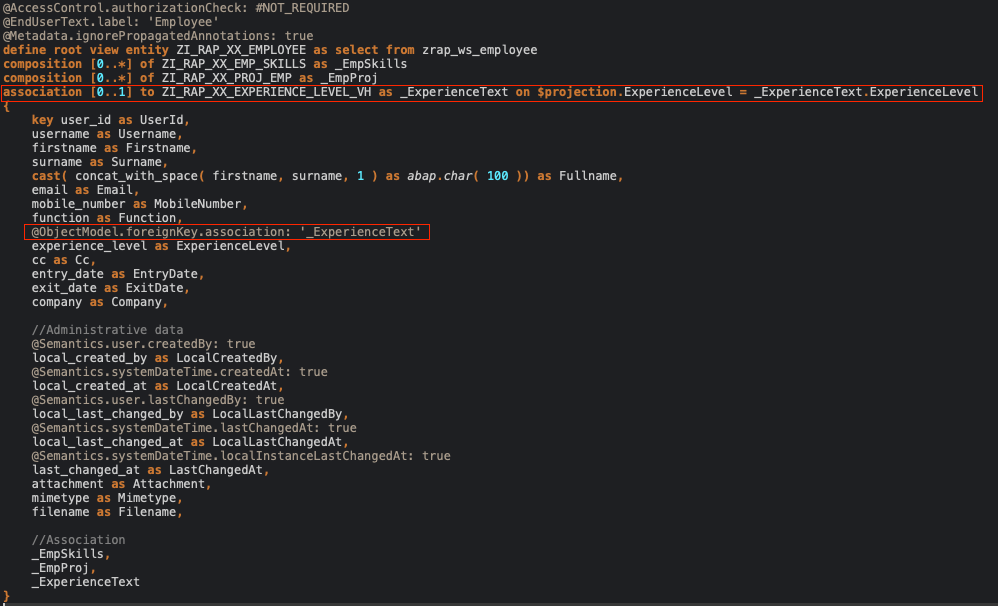
</figure>

Im Anschluss ergänzen wir noch in unserer Consumption-View ZC_RAP_XX_EMPLOYEE folgende Annotation:
<figure style="border:1px solid #aaa; padding:10px; display:inline-block;">
  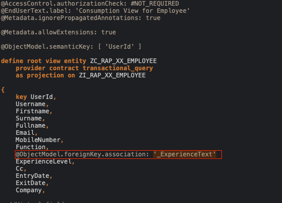
</figure>


Als nächsten Schritt ergänzen wir noch die Metadata Extension ZC_RAP_XX_EMPLOYEE.
<figure style="border:1px solid #aaa; padding:10px; display:inline-block;">
  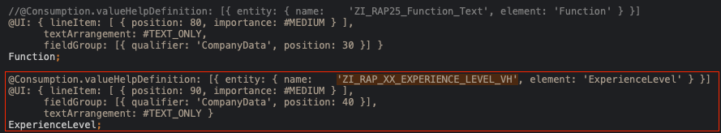
</figure>

Abschließend exposen wir die ZI_RAP_XX_EXPERIENCE_LEVEL_VH in unserer Service Definition.
<figure style="border:1px solid #aaa; padding:10px; display:inline-block;">
  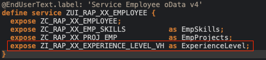
</figure>

Jetzt sehen wir in der Preview den Text anstatt die Id.
<figure style="border:1px solid #aaa; padding:10px; display:inline-block;">
  
</figure>

Aufgrund der wenigen Werte würde sich hier ein Dropdown-Menü anbieten.

>**Fiori Guidelines**
>- Bis zu 10 Werte: Nutzen Sie eine Select List (Dropdown) oder Radio Buttons.
>- 10 bis 30 Werte: Ein Dropdown ist noch möglich, idealerweise mit In-App-Filterung (ComboBox / Suchen im Dropdown).
>- Ab 30 Werten: Nutzen Sie eine Wertehilfe (Value Help) oder ein Smart Control mit Autocomplete.
>- Ab 200 Werten: Eine Wertehilfe ist zwingend erforderlich, da Standard-Dropdowns hier technisch und visuell gekappt werden.

Um die Wertehilfe in ein Dropdown umzuwandeln, fügen wir die folgende Annotation in der ZI_RAP_XX_EXPERIENCE_LEVEL_VH hinzu:

<figure style="border:1px solid #aaa; padding:10px; display:inline-block;">
  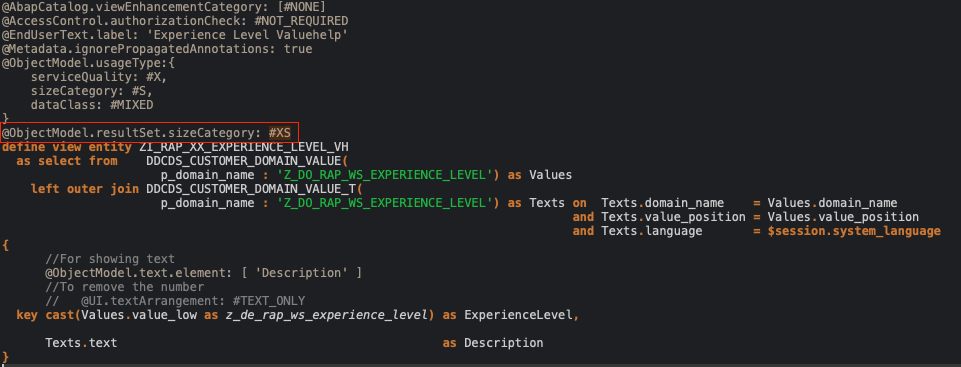
</figure>

Das #XS steht hat keine visuellen Auswirkungen, da es lediglich für die zu erwartende Datenmend steht (XS typischerweise bis 100).

<figure style="border:1px solid #aaa; padding:10px; display:inline-block;">
  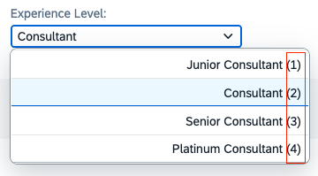
</figure>

Wenn uns jetzt noch die Zahlen im Dropdown stören, können wir diese auch ausblenden, indem wir in der Werthilfe ZI_RAP_XX_EXPERIENCE_LEVEL_VH folgende Zeile einkommentieren:

<figure style="border:1px solid #aaa; padding:10px; display:inline-block;">
  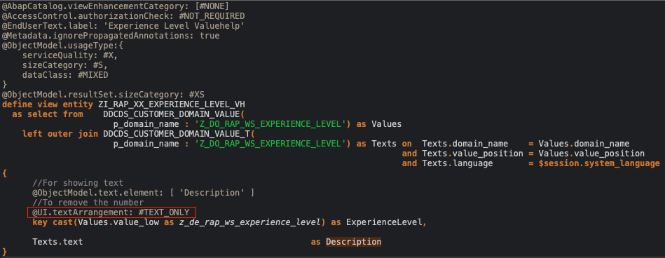
</figure>

Jetzt sind die Zahlen verschwunden.

<figure style="border:1px solid #aaa; padding:10px; display:inline-block;">
  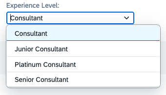
</figure>

Abgesehen vom ausblenden der Zahlen könnte man auch mit der Position herumspielt. Bitte mal ausprobieren, indem du den Wert bei @UI.textArrangement: #TEXT_ONLY auf die anderen Werte änderst. Anzeigen lassen kannst du die werte in dem du mit dem Cursor hinter die Raute springst und eine der beiden Tastenkombinationen drückst.

 MacOs:
>cmd + Leerstaste

oder bei Windows:

>strg + Leertaste 

<figure style="border:1px solid #aaa; padding:10px; display:inline-block;">
  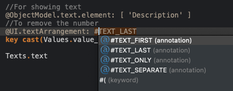
</figure>

Jetzt müssen wir das gleiche noch für Skills und Projects machen.

### 7.3.3 Anlage Interface-View für Skill Text
Lege eine Interface-View ZI_RAP_SKILL_VH an. Klicke hierfür mit einem Rechtsklick auf Data Definitions und dann New Data Definition
<figure style="border:1px solid #aaa; padding:10px; display:inline-block;">
  
</figure>

Trage im Popup alle Daten gemäß dem Screenshot ein. Achte hierbei wieder darauf "XX" mit deiner Nummer zu ersetzen! Nach Eingabe der Informationen bitte nur auf "Next" und NICHT auf "Finish" klicken!
Denn auch hier können wir bestimmen welches Template wir generieren lassen wollen. Wähle hier unter dem Reiter View  "defineViewEntity" aus. 

<figure style="border:1px solid #aaa; padding:10px; display:inline-block;">
  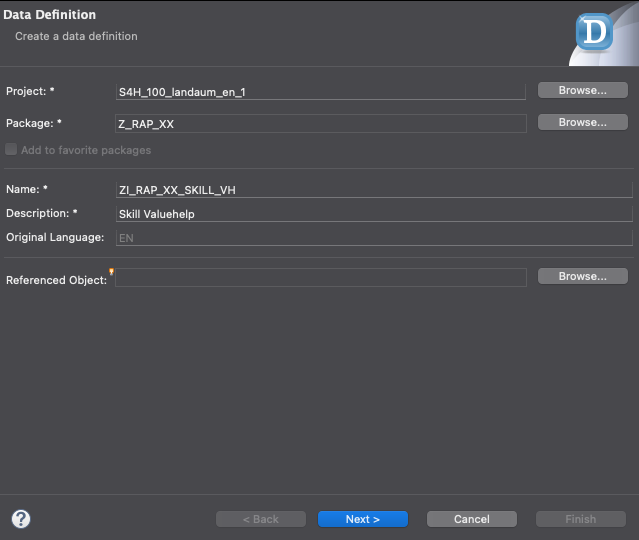
       <figcaption style="text-align:center;"><span style="color: red">XX durch die Nummer ersetzen</span></figcaption>
</figure>

Dort tragen wir folgendes ein:
<figure style="border:1px solid #aaa; padding:10px; display:inline-block;">
  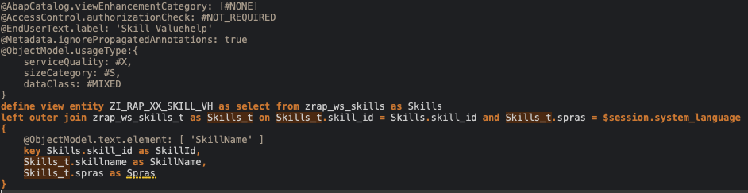
</figure>

Nun fügen wir die Association in der ZI_RAP_XX_EMP_SKILLS hinzu.
<figure style="border:1px solid #aaa; padding:10px; display:inline-block;">
  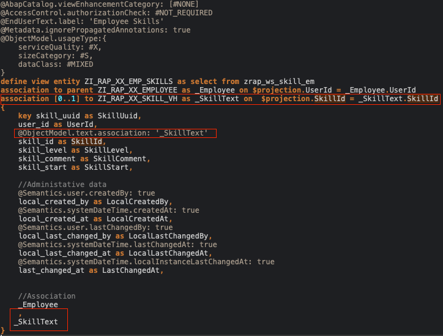
</figure>

Im Anschluss fügen wir die Association in der ZC_RAP_XX_EMP_SKILLS hinzu.

<figure style="border:1px solid #aaa; padding:10px; display:inline-block;">
  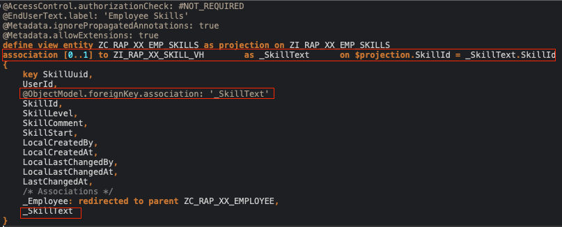
</figure>

In der Metadata Extension ZC_RAP_XX_EMP_SKILLS die Wertehilfe einkommentieren.
<figure style="border:1px solid #aaa; padding:10px; display:inline-block;">
  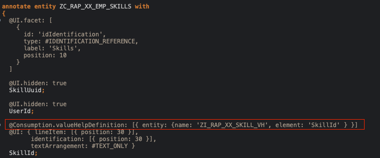
</figure>

Als letztes noch in der Service Definition Exposen:
<figure style="border:1px solid #aaa; padding:10px; display:inline-block;">
  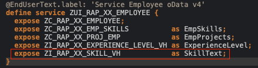
</figure>

In der Preview erscheinen jetzt auch für Skills die Texte.
<figure style="border:1px solid #aaa; padding:10px; display:inline-block;">
  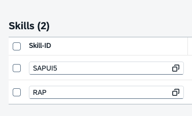
</figure>

### 7.3.4 Anlage Interface-View für Project Text
Lege eine Interface-View ZI_RAP_PROJ_VH an. Klicke hierfür mit einem Rechtsklick auf Data Definitions und dann New Data Definition
<figure style="border:1px solid #aaa; padding:10px; display:inline-block;">
  
</figure>

Trage im Popup alle Daten gemäß dem Screenshot ein. Achte hierbei wieder darauf "XX" mit deiner Nummer zu ersetzen! Nach Eingabe der Informationen bitte nur auf "Next" und NICHT auf "Finish" klicken!
Denn auch hier können wir bestimmen welches Template wir generieren lassen wollen. Wähle hier unter dem Reiter View  "defineViewEntity" aus. 

<figure style="border:1px solid #aaa; padding:10px; display:inline-block;">
  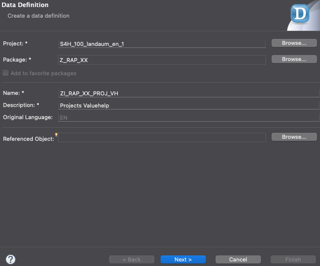
       <figcaption style="text-align:center;"><span style="color: red">XX durch die Nummer ersetzen</span></figcaption>
</figure>
Tragen ensprechend diese Infos ein (hier machen wir es ohne zusätzliche Texttabelle):
<figure style="border:1px solid #aaa; padding:10px; display:inline-block;">
  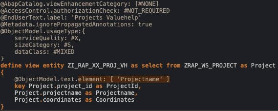
</figure>

Dann ergänzen wir die Association in der ZI_RAP_XX_PROJ_EMP.
<figure style="border:1px solid #aaa; padding:10px; display:inline-block;">
  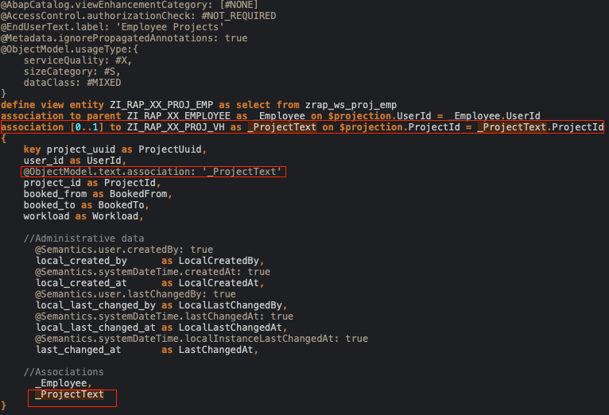
</figure>


Im Anschluss noch in der ZC_RAP_XX_PROJ_EMP Consumption-View.
<figure style="border:1px solid #aaa; padding:10px; display:inline-block;">
  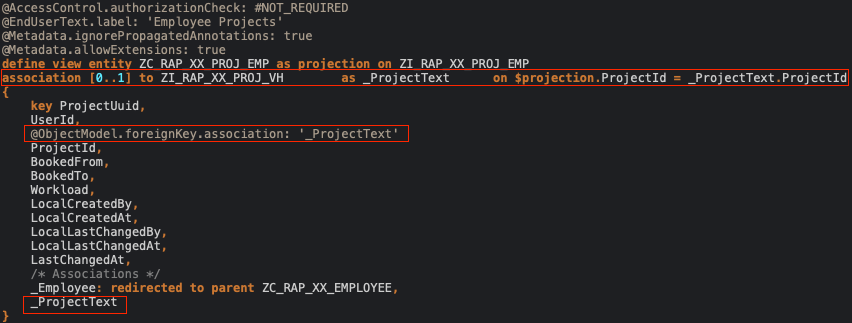
</figure>

Das Einkommentieren in der Metadata Extension ZC_RAP_XX_PROJ_EMP nicht vergessen.
<figure style="border:1px solid #aaa; padding:10px; display:inline-block;">
  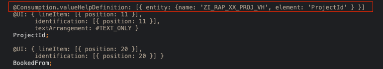
</figure>


Als letzter Schritt wieder in der Service Definition exposen.
<figure style="border:1px solid #aaa; padding:10px; display:inline-block;">
  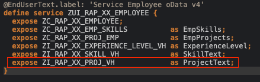
</figure>

Bei einem erneuten Blick in die Preview, sehen wir auch jetzt die Texte von den Projekten.
<figure style="border:1px solid #aaa; padding:10px; display:inline-block;">
  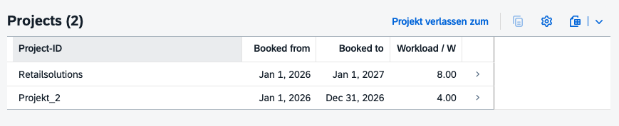
</figure>


### 7.4 Berechnung virtueller Elemente 
Das virtuelle Element wird in der Klasse 'ZCL_RAP_WS_EMPLOYEE_EXIT' zur Laufzeit ermittelt. Die Berechnungsklasse muss das Interface IF_SADL_EXIT_CALC_ELEMENT_READ implementieren. Dieses Interface stellt zwei Methoden für die Berechnungsimplementierung zur Verfügung:
- get_calculation_info: Diese Methode wird vor der eigentlichen Datenbeschaffung aufgerufen. Dadurch wird sichergestellt, dass alle relevanten Elemente ausgewählt werden, die für die Berechnung des virtuellen Elements benötigt werden.
- calculate: Diese Methode wird nach der Datenbeschaffung aufgerufen. Es verwendet die Werte der relevanten Elemente, um den Wert für das virtuelle Element zu berechnen.

Die Klasse kann entweder selbst angelegt werden mit dem "ZCL_RAP_XX_EMPLOYEE_EXIT" oder man kann die ZCL_RAP_WS_EMPLOYEE_EXIT verwenden.

#### 7.4.1 Verwenden der bestehenden Klasse
Wenn wir die bestehende Klasse "ZCL_RAP_WS_EMPLOYEE_EXIT_CALC" verwenden können wir den nächsten Schritt (7.4.2 Anlegen der Klasse) überspringen. Bei 7.5.3 und 7.5.4 müssen wir natürlich 


#### 7.4.2 Anlegen der Klasse
Um die Klasse manuell anzulegen, klicke mit einem Rechtsklick auf "Source Code Library" -> New -> ABAP Class
<figure style="border:1px solid #aaa; padding:10px; display:inline-block;">
  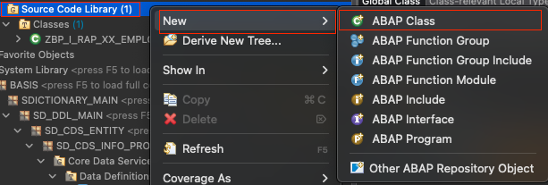
</figure>

<figure style="border:1px solid #aaa; padding:10px; display:inline-block;">
  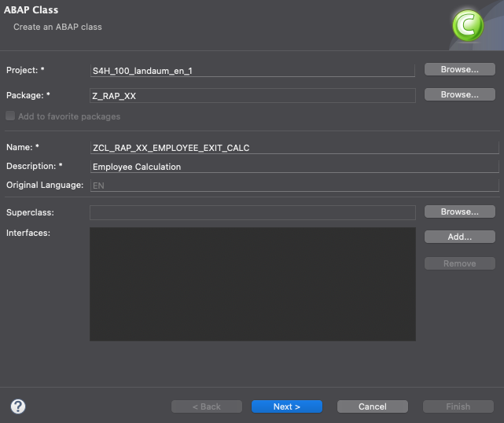
       <figcaption style="text-align:center;"><span style="color: red">XX durch die Nummer ersetzen</span></figcaption>
</figure>

Trage die Werte entsprechend dem Screenshot ein. Hier könnte auch schon das Interface beim Anlegen hinzugefügt werden. Wir machen es aber erst gleich im Code. Wie immer daran denken das XX auszutauschen.

Füge im Anschluss folgendes in die Klasse ein und ändere zcl_rap_xx_employee_exit_calc, zc_rap_xx_employee-userid, zc_rap_xx_employee, zi_rap_xx_proj_emp

```
CLASS zcl_rap_xx_employee_exit_calc DEFINITION
  PUBLIC
  FINAL
  CREATE PUBLIC .

  PUBLIC SECTION.

  interfaces IF_SADL_EXIT .
  interfaces IF_SADL_EXIT_CALC_ELEMENT_READ .
  PROTECTED SECTION.
  PRIVATE SECTION.
ENDCLASS.


CLASS zcl_rap_xx_employee_exit_calc IMPLEMENTATION.
  METHOD IF_SADL_EXIT_CALC_ELEMENT_READ~CALCULATE.
    DATA: lt_user_range TYPE RANGE OF zc_rap_xx_employee-userid.
    DATA: lt_calculated_data TYPE STANDARD TABLE OF zc_rap_xx_employee.

    lt_calculated_data = CORRESPONDING #( it_original_data ).
    CHECK lt_calculated_data IS NOT INITIAL.

    lt_user_range = VALUE #( FOR ls_line IN lt_calculated_data ( sign = 'I' option = 'EQ' low = ls_line-userid ) ).

    SELECT userid, SUM( workload ) AS total_workload
      FROM zi_rap_xx_proj_emp
      WHERE userid IN @lt_user_range
      GROUP BY userid
      INTO TABLE @DATA(lt_workload_totals).

    LOOP AT lt_calculated_data ASSIGNING FIELD-SYMBOL(<ls_calculated_data>).
      <ls_calculated_data>-totalworkloadperweek =  VALUE #( lt_workload_totals[ userid = <ls_calculated_data>-userid ]-total_workload OPTIONAL ).

        IF <ls_calculated_data>-totalworkloadperweek >= 5.
    <ls_calculated_data>-workloadcriticality = 4.
  ELSEIF <ls_calculated_data>-totalworkloadperweek >= 3.
    <ls_calculated_data>-workloadcriticality = 3.
  ELSE.
    <ls_calculated_data>-workloadcriticality = 2.
  ENDIF.

    ENDLOOP.

    ct_calculated_data = CORRESPONDING #( lt_calculated_data  ).

  ENDMETHOD.


  method IF_SADL_EXIT_CALC_ELEMENT_READ~GET_CALCULATION_INFO.
  endmethod.
ENDCLASS.
```

**HINWEIS:** Die Klasse kann noch nicht aktiviert werden, da noch die virtuellen Felder in der Consumption-View fehlen.

#### 7.4.3 Virtuelle Felder in der Consumption-View
Füge in der Consumption-View (ZC_RAP_XX_EMPLOYEE) folgendes unter "Company" ein:
```
//Virtual fields
//@ObjectModel.virtualElement: true
@EndUserText.label: 'Auslastung gesamt'
@ObjectModel.virtualElementCalculatedBy: 'ABAP:ZCL_RAP_WS_EMPLOYEE_EXIT_CALC'
virtual TotalWorkloadPerWeek : z_de_rap_ws_days_per_week,
    
//@ObjectModel.virtualElement: true
@ObjectModel.virtualElementCalculatedBy: 'ABAP:ZCL_RAP_WS_EMPLOYEE_EXIT_CALC'
virtual WorkloadCriticality : abap.int1, 
```

#### 7.4.4 Virtuelle Felder in der Metadata Extension
Nun fügen wir unser Feld noch in der Metadata Extension zwischen ExperienceLevel und EntryDate:
```
  @UI: { lineItem: [ { position: 95, importance: #MEDIUM } ],
         fieldGroup: [{ qualifier: 'CompanyData', position: 50 }]}
  TotalWorkloadPerWeek;
  ```
**Hinweis:** Hier machen wir uns zu Nutze, dass wir die Positionen in zehner Schritte vergeben haben und geben deswegen unserem Feld die Position 95.

Jetzt noch alles aktivieren und dann erscheint unser neues Feld im UI.

<figure style="border:1px solid #aaa; padding:10px; display:inline-block;">
  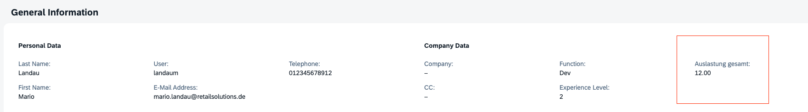
</figure>

Die 12 wird in unserem Fall aus den beiden Projekten hier berechnet:

<figure style="border:1px solid #aaa; padding:10px; display:inline-block;">
  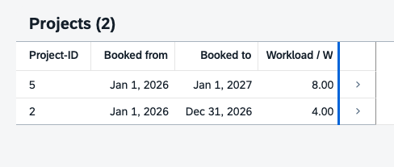
</figure>

### 7.5 Wertehilfen
Wertehilfen sind für uns nix neues mehr. Deshalb fällt hier die Beschreibung etwas kürzer aus. Die Wertehilfen sind bereits im Paket Z_RAP_WS erstellt und müssen nur noch eingebunden. Je nach Zeit und Interesse können wir hier alle manuell anlegen.

>**HINWEIS** Wenn genug Zeit ist legen wir die Wertehilfen selbst an.

### 7.5.1 Company
In ZI_RAP_XX_EMPLOYEE
>association [0..1] to ZI_RAP_WS_COMPANY_VH as _CompanyText on $projection.Company = _CompanyText.Company<br><br>
>@ObjectModel.foreignKey.association: '_CompanyText'<br><br>
>_CompanyText,

In ZC_RAP_XX_EMPLOYEE
>    @ObjectModel.foreignKey.association: '_CompanyText'
>    _CompanyText

In ZC_RAP_XX_EMPLOYEE (Metadata Extension)
>   @Consumption.valueHelpDefinition: [ { entity: {name: 'ZI_RAP_WS_COMPANY_VH', element: 'Company' } } ]

In Service Definition ZUI_RAP_XX_EMPLOYEE
>expose ZI_RAP_WS_COMPANY_VH          as Company;
### 7.5.2 CC (Team)
In ZI_RAP_XX_EMPLOYEE
>association [0..1] to ZI_RAP_WS_CC_VH as _Cc on $projection.CC = _CC.CcName<br><br>
>@ObjectModel.foreignKey.association: '_Cc'<br><br>
>_Cc

In ZC_RAP_XX_EMPLOYEE
>    @ObjectModel.foreignKey.association: '_Cc'
>    _Cc

In ZC_RAP_XX_EMPLOYEE (Metadata Extension)
>@Consumption.valueHelpDefinition: [ { entity: {name: 'ZI_RAP_WS_CC_VH', element: 'CcName' } } ]

In Service Definition ZUI_RAP_XX_EMPLOYEE
>expose ZI_RAP_WS_COMPANY_VH          as CcName;
### 7.5.3 Function
In ZI_RAP_XX_EMPLOYEE
>association [0..1] to ZI_RAP_WS_FUNCTION_VH as _Function on $projection.Function = _Function.Function <br><br>
>@ObjectModel.foreignKey.association: '_Function'
><br><br>_Function

In ZC_RAP_XX_EMPLOYEE
>@ObjectModel.foreignKey.association: '_Function'<br><br>
>_Function

In ZC_RAP_XX_EMPLOYEE (Metadata Extension)
>  @Consumption.valueHelpDefinition: [{ entity: { name:    'ZI_RAP_WS_Function_VH', element: 'Function' } }]

In Service Definition ZUI_RAP_XX_EMPLOYEE
>expose ZI_RAP_WS_FUNCTION_VH         as FunctionName;

### 7.5.4 User
ACHTUNG! Bitte hier normalerweise über die UserId joinen. Es konnte hier nur nicht mehr ohne weiteres Rückgäng gemacht werden.

In ZI_RAP_XX_EMPLOYEE
>association [0..1] to ZI_RAP_WS_USER_VH as _User on $projection.Surname = _User.FamilyName<br><br>

In ZC_RAP_XX_EMPLOYEE
>@ObjectModel.foreignKey.association: '_User'<br><br>

In ZC_RAP_XX_EMPLOYEE (Metadata Extension)
>   @Consumption.valueHelpDefinition: [ { entity: {name: 'ZI_RAP_WS_USER_VH', element: 'UserId' } } ]

In Service Definition ZUI_RAP_XX_EMPLOYEE
>expose ZI_RAP_WS_USER_VH             as UserId;

## Teil 8. Übersetzungen
Innerhalb der CDS Views definierte Label können über die SE63 per Transportobjekte übersetzt werden.
In der Se63 wird durch einen Klick auf Shorttext ein Popup geöffnet. Dort kannst du die Ordnerstruktur A5 User Inferface erweitern.

<figure style="border:1px solid #aaa; padding:10px; display:inline-block;">
  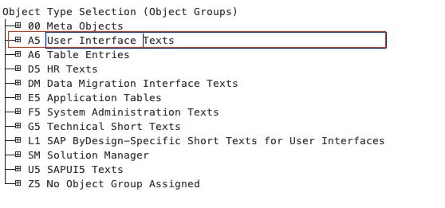
</figure>

Anschließend suchen wir in der aufgeklappten Ordnerstruktur 'CDS Views' und klicken den Eintrag an. 

<figure style="border:1px solid #aaa; padding:10px; display:inline-block;">
  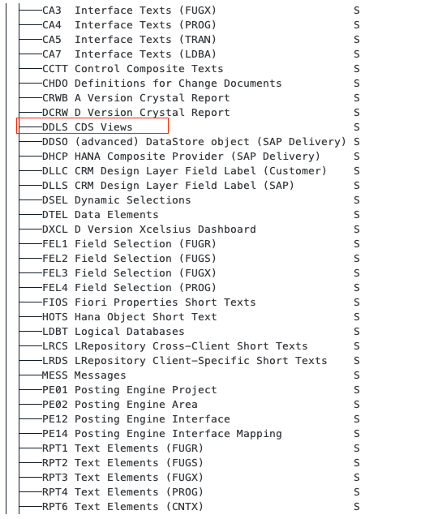
</figure>

Jetzt können wir bei Object Name entweder direkt die CDS View eintragen, oder wir suchen unsere Views.

<figure style="border:1px solid #aaa; padding:10px; display:inline-block;">
  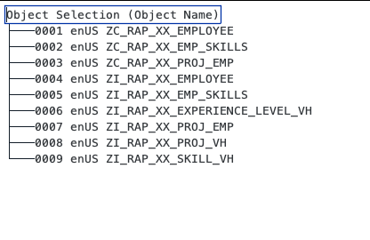
</figure>

Im Anschluss kommen wir mit einem Klick auf den Edit Button, in diese Oberfläche.

<figure style="border:1px solid #aaa; padding:10px; display:inline-block;">
  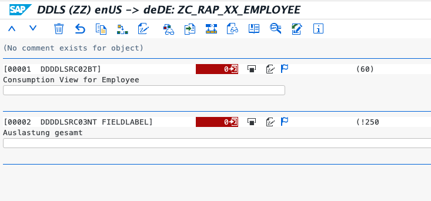
</figure>

Dort können dann entsprechend die Übersetzungen eingetragen werden.


## 9 Business Application Studio (BAS)
Das Business Application Studio ist unter diesem Link erreichtbar:
>https://rap-ws-7noess8f.eu10cf.applicationstudio.cloud.sap/index.html

Der Dev Space wurde im Vorgang schon angelegt, weshalb wir ihn jetzt hier nur noch starten müssen mit einem Klick auf den Play Button. Nachdem der Status auf "Running" steht, könne wir auf den Namen unseres Dev Spaces klicken und gelangen somit in die BAS Oberfläche. Dort klicken wir direkt auf "New Project from Template" um ein neues Projekt anzulegen.

<figure style="border:1px solid #aaa; padding:10px; display:inline-block;">
  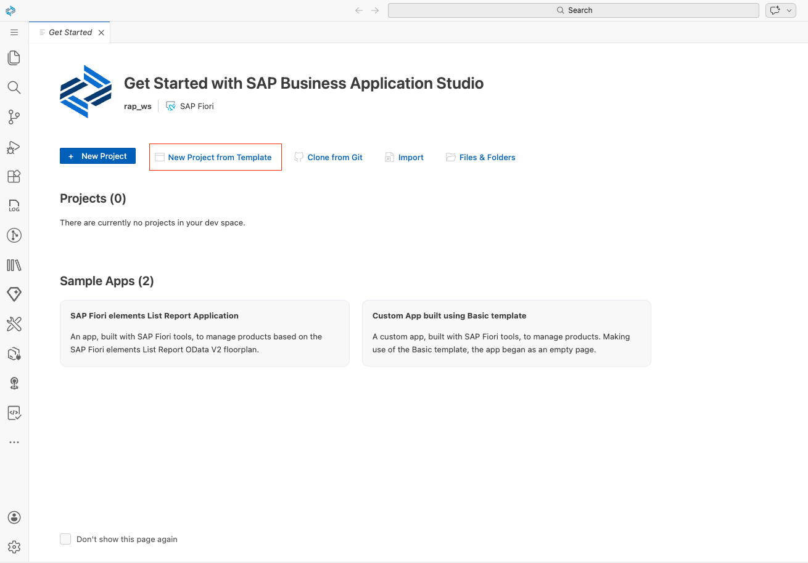
</figure>

Im nächsten Screen wählen wir den "SAP FIORI generator" und klicken auf "Start".


<figure style="border:1px solid #aaa; padding:10px; display:inline-block;">
  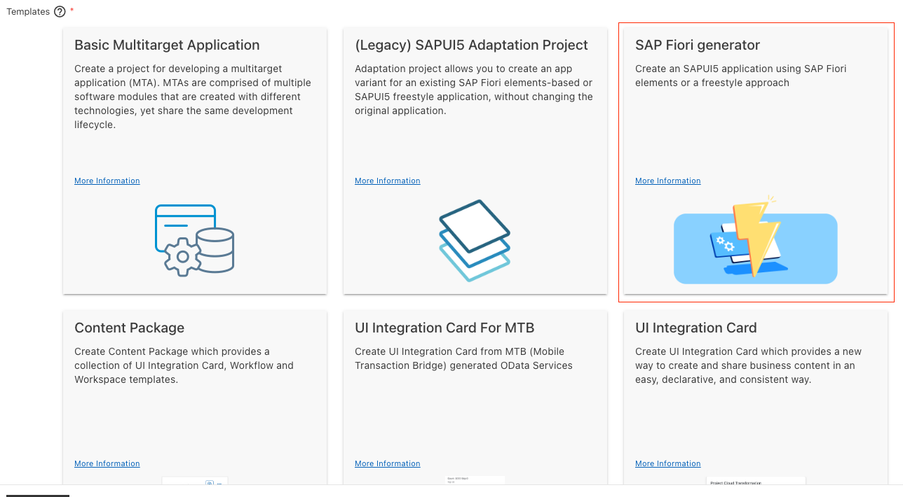
</figure>

Dann wählen wir für unseren Zweck einen List Report aus und klicken auf "Next".
<figure style="border:1px solid #aaa; padding:10px; display:inline-block;">
  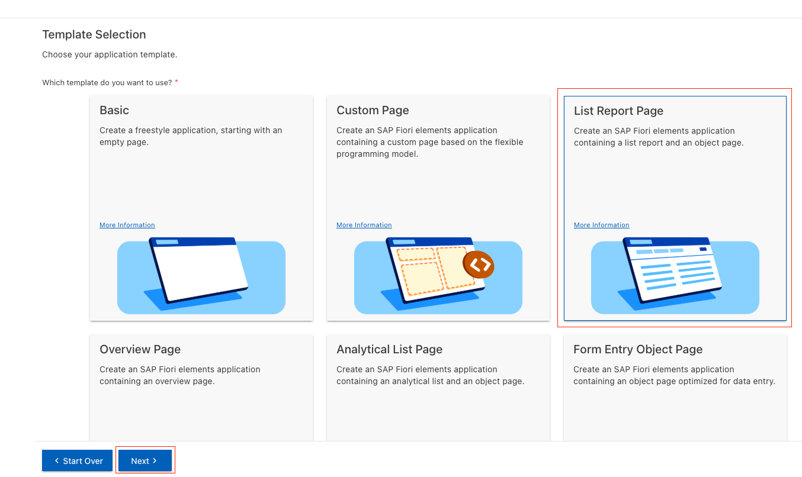
</figure>

Im Anschluss wählen wir "Connect to a System" aus und unser entsprechendes System, sowie unseren Service.

<figure style="border:1px solid #aaa; padding:10px; display:inline-block;">
  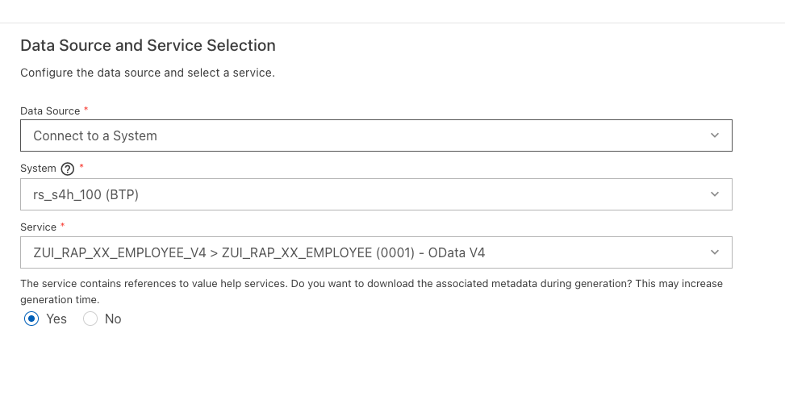
</figure>

Danach wählen wir unsere Employee Entität also Main Entitiy:
<figure style="border:1px solid #aaa; padding:10px; display:inline-block;">
  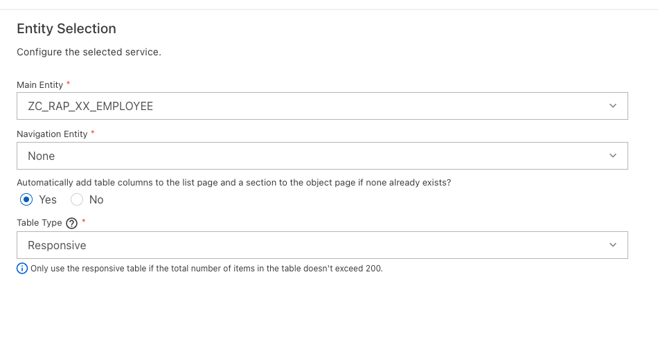
</figure>

Wir könnnen jetzt hier einen Modul Name und einen App Title vergeben. Die restlichen Angaben sind Geschmackssache.
<figure style="border:1px solid #aaa; padding:10px; display:inline-block;">
  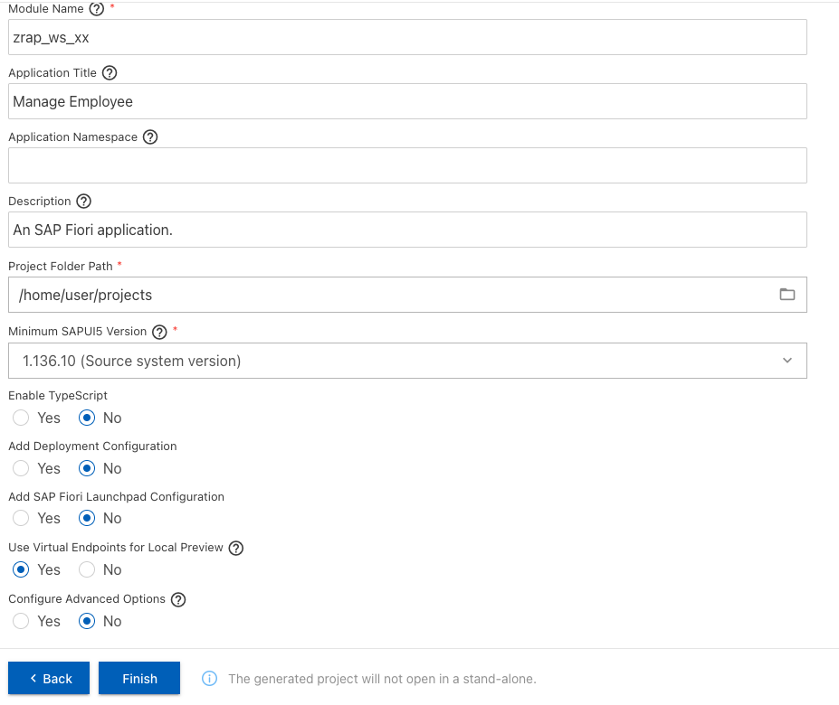
</figure>

Abschließend ein Klick auf Finish und unser Projekt wird generiert. Sobald das Projekt generiert wurden, können wir uns mit einem Rechtsklick auf webapp und dann Preview Application unsere App ansehen.

<figure style="border:1px solid #aaa; padding:10px; display:inline-block;">
  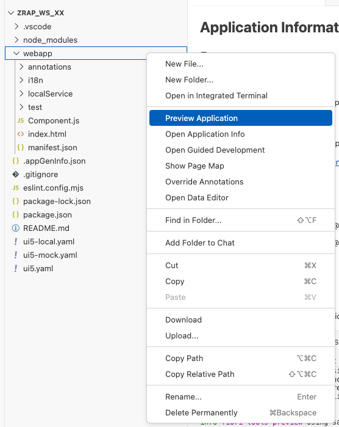
</figure>

**HINWEIS** GGF. muss noch npm install im Terminal ausgeführt werden.

## 10 SAPUI5

## 10.1 Intro & Wichtige Links
## 10.2 Spalte SkillLevel erstellen
## 10.3 i18n
## 10.4 Section anlegen
## 10.5 GGF. Custom Code


